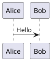

# PlantUML Diagram Generator

## Diagram Types

| Type       | Purpose                          | Keywords                  |
|------------|----------------------------------|---------------------------|
| Class      | Classes, interfaces, inheritance | "class", "类", "继承"        |
| Sequence   | Message flow over time           | "sequence", "序列", "交互"    |
| Activity   | Workflows, processes             | "activity", "活动", "流程"    |
| State      | Object state transitions         | "state", "状态", "转换"       |
| Component  | System components                | "component", "组件", "架构"   |
| Deployment | Hardware/software topology       | "deployment", "部署", "服务器" |
| Use Case   | User interactions                | "use case", "用例", "角色"    |
| Object     | Object instances snapshot        | "object", "对象", "实例"      |
| Timing     | Time-based state changes         | "timing", "时序", "时间线"     |

## Quick Syntax

After determining the diagram type, read the corresponding reference file for detailed syntax.

**Core patterns (for initial generation, verify in reference if unsure):**

| Type       | Key Syntax                                                        |
|------------|-------------------------------------------------------------------|
| Class      | `class Name { field }`, `A <\|-- B` (inherit), `A --> B` (depend) |
| Sequence   | `A -> B: Message`, `actor User`, `participant Sys`                |
| Activity   | `start`, `:Action;`, `if (...) then`, `while (...)`, `stop`       |
| State      | `[*] --> State`, `State --> State2: Transition`                   |
| Component  | `[Component]`, `() Interface`, `[A] --> [B]`                      |
| Deployment | `node "Server"`, `database "DB"`, `node A --> node B`             |
| Use Case   | `actor User`, `(Use Case)`, `User --> UC`                         |
| Object     | `object Obj { field = value }`, `Obj1 --> Obj2`                   |
| Timing     | `robust "Signal"`, `@0 S is Idle`, `@100 S is Active`             |

**Important**: Comments with `'` must be on their own line. Inline comments are NOT supported.

## Output Format

Always use `plantuml` language identifier:

## Detailed Syntax

**CRITICAL**: After identifying the diagram type, READ the corresponding reference file before generating code:

- `references/class-diagram.md`
- `references/sequence-diagram.md`
- `references/activity-diagram.md`
- `references/state-diagram.md`
- `references/component-diagram.md`
- `references/deployment-diagram.md`
- `references/use-case-diagram.md`
- `references/object-diagram.md`
- `references/timing-diagram.md`

Reference files contain: notes syntax, relationship types, stereotypes, colors, grouping, swimlanes, composite states, fork/join, skinparam, and common mistakes to avoid.

## Type Selection Guide

If user doesn't specify diagram type, ask:

"您想要哪种类型的图表？
- 类图: 展示类的结构和继承关系
- 序列图: 展示对象间的消息交互流程
- 活动图: 展示工作流程或业务流程
- 状态图: 展示对象的状态转换
- 组件图: 展示系统组件结构
- 部署图: 展示软硬件部署拓扑
- 用例图: 展示用户与系统的交互
- 对象图: 展示对象实例快照
- 时序图: 展示基于时间的状态变化"

Or infer:
- "类之间的关系" → Class Diagram
- "API调用流程" → Sequence Diagram
- "业务流程" → Activity Diagram
- "状态变化" → State Diagram
- "系统架构" → Component/Deployment Diagram
