## Activity Diagram (New Syntax)

The [previous syntax used for activity diagrams](activity-diagram-legacy) encountered several limitations and maintainability issues. Recognizing these drawbacks, we have introduced a wholly revamped syntax and implementation that is not only user-friendly but also more stable.

### Benefits of the New Syntax

- No Dependency on Graphviz: Just like with sequence diagrams, the new syntax eliminates the necessity for Graphviz installation, thereby simplifying the setup process.
- Ease of Maintenance: The intuitive nature of the new syntax means it is easier to manage and maintain your diagrams.

### Transition to the New Syntax
While we will continue to support the old syntax to maintain compatibility, we highly encourage users to migrate to the new syntax to leverage the enhanced features and benefits it offers.

Make the shift today and experience a more streamlined and efficient diagramming process with the new activity diagram syntax.


## Simple action
Activities label starts with ``:`` and ends with ``;``.

Text formatting can be done using [creole wiki syntax](creole).

They are implicitly linked in their definition order.
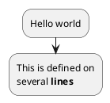


## Other simple action _(defined as a list)_

### Simple action list separated by ``-``
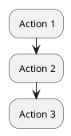


### Simple action list separated by ``*``

#### With one level
```plantuml
@startuml
* Action 1
* Action 2
* Action 3
@enduml
```

#### With several levels
```plantuml
@startuml
<style>
element {MinimumWidth 150}
</style>
* Action 1
** Sub-Action 1.1
** Sub-Action 1.2
*** Sub-Action 1.2.1
*** Sub-Action 1.2.2
* Action 2
@enduml
```

*[Ref. [GH-2376](https://github.com/plantuml/plantuml/pull/2376)]*


## Start/Stop/End

You can use ``start`` and ``stop`` keywords to denote the
beginning and the end of a diagram.

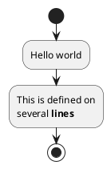

You can also use the ``end`` keyword.
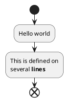


## Conditional [if, then, else, endif]

You can use ``if``, ``then``, ``else`` and ``endif`` keywords to put tests in your diagram.
Labels can be provided using parentheses.

The 3 syntaxes are possible:
* ``if (...) then (...) ... [else (...) ...] endif``
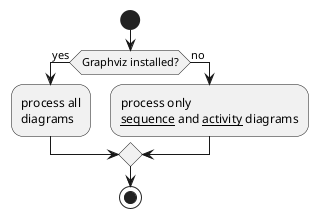

* ``if (...) is (...) then ... [else (...) ...] endif``
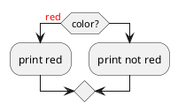

* ``if (...) equals (...) then ... [else (...) ...] endif``
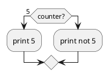

*[Ref. [QA-301](https://forum.plantuml.net/301/activity-diagram-beta?show=302#a302)]*

### Several tests (horizontal mode)

You can use the ``elseif`` keyword to have several tests *(by default, it is the horizontal mode)*:

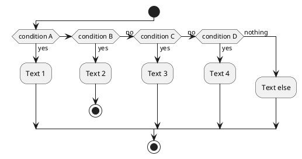

### Several tests (vertical mode)

You can use the command ``!pragma useVerticalIf on`` to have the tests in vertical mode:

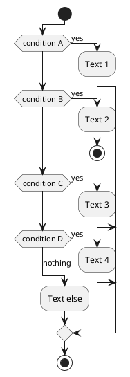

You can use the ``-P`` [command-line](command-line) option to specify the pragma:

```
java -jar plantuml.jar -PuseVerticalIf=on
```

*[Refs. [QA-3931](https://forum.plantuml.net/3931/please-provide-elseif-structure-vertically-activity-diagrams), [GH-582](https://github.com/plantuml/plantuml/issues/582)]*


### Common Mistakes: If Syntax

**WRONG** - Missing `then` after `is`:

```plantuml
' ❌ WRONG: 'is' must be followed by 'then'
if (Condition?) is (yes)
  :Branch A;
else (no)
  :Branch B;
endif
```

**CORRECT** - `is` followed by `then`:

```plantuml
' ✅ CORRECT: 'is (label) then' is the proper syntax
if (Condition?) is (yes) then
  :Branch A;
else (no)
  :Branch B;
endif
```

Alternative correct form using `then` directly:

```plantuml
' ✅ ALSO CORRECT: 'then (label)' without 'is'
if (Condition?) then (yes)
  :Branch A;
else (no)
  :Branch B;
endif
```

Both forms work, but `if (...) is (label) then` is the canonical PlantUML activity diagram syntax.


## Switch and case [switch, case, endswitch]

You can use ``switch``, ``case`` and ``endswitch`` keywords to put switch in your diagram.

Labels can be provided using parentheses.


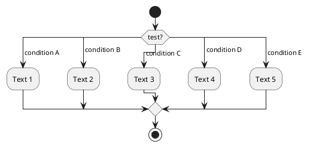


## Conditional with stop on an action [kill, detach]

You can stop action on a if loop.
```plantuml
@startuml
if (condition?) then
  :error;
  stop
endif
:action; <<#palegreen>>
@enduml
```

But if you want to stop at the precise action, you can use the `kill` or `detach` keyword:

* `kill`
```plantuml
@startuml
if (condition?) then
  :error; <<#pink>>
  kill
endif
:action; <<#palegreen>>
@enduml
```

*[Ref. [QA-265](https://forum.plantuml.net/265/new-activity-diagram-syntax-direction-of-links?show=306#a306)]*

* `detach`
```plantuml
@startuml
if (condition?) then
  :error; <<#pink>>
  detach
endif
:action; <<#palegreen>>
@enduml
```


## Repeat loop

### Simple repeat loop

You can use ``repeat`` and ``repeat while`` keywords to have repeat loops.

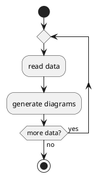

### Repeat loop with repeat action and backward action

It is also possible to use a full action as ``repeat`` target and insert an action in the return path using the ``backward`` keyword.

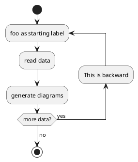
*[Ref. [QA-5826](https://forum.plantuml.net/5826/please-provide-action-repeat-loop-start-instead-condition?show=5831#a5831)]*


## Break on a repeat loop [break]

You can use the ``break`` keyword after an action on a loop.
```plantuml
@startuml
start
repeat
  :Test something;
    if (Something went wrong?) then (no)
      :OK; <<#palegreen>>
      break
    endif
    ->NOK;
    :Alert "Error with long text";
repeat while (Something went wrong with long text?) is (yes) not (no)
->//merged step//;
:Alert "Success";
stop
@enduml
```


*[Ref. [QA-6105](https://forum.plantuml.net/6105/possible-to-draw-a-line-to-another-box-via-id-or-label?show=6107#a6107)]*


## Goto and Label Processing [label, goto]

⚠ It is currently only experimental 🚧

You can use ``label`` and ``goto`` keywords to denote goto processing, with:
* ``label <label_name>``
* ``goto <label_name>``

```plantuml
@startuml
title Point two queries to same activity\nwith `goto`
start
if (Test Question?) then (yes)
'space label only for alignment
label sp_lab0
label sp_lab1
'real label
label lab
:shared;
else (no)
if (Second Test Question?) then (yes)
label sp_lab2
goto sp_lab1
else
:nonShared;
endif
endif
:merge;
@enduml
```

*[Ref. [QA-15026](https://forum.plantuml.net/15026/), [QA-12526](https://forum.plantuml.net/12526/) and initially [QA-1626](https://forum.plantuml.net/1626)]*


## While loop

### Simple while loop

You can use ``while`` and ``endwhile`` keywords to have while loop.

```plantuml
@startuml

start

while (data available?)
  :read data;
  :generate diagrams;
endwhile

stop

@enduml
```

It is possible to provide a label after the ``endwhile`` keyword, or using the ``is`` keyword.

```plantuml
@startuml
while (check filesize ?) is (not empty)
  :read file;
endwhile (empty)
:close file;
@enduml
```

### While loop with backward action
It is also possible to insert an action in the return path using the ``backward`` keyword.

```plantuml
@startuml
while (check filesize ?) is (not empty)
  :read file;
  backward:log;
endwhile (empty)
:close file;
@enduml
```

*[Ref. [QA-11144](https://forum.plantuml.net/11144/backward-for-while-endwhile)]*


### Infinite while loop

If you are using ``detach`` to form an infinite while loop, then you will want to also hide the partial arrow that results using ``-[hidden]->``

```plantuml
@startuml
:Step 1;
if (condition1) then
  while (loop forever)
   :Step 2;
  endwhile
  -[hidden]->
  detach
else
  :end normally;
  stop
endif
@enduml
```


## Parallel processing [fork, fork again, end fork, end merge]

You can use ``fork``, ``fork again`` and ``end fork`` or ``end merge`` keywords to denote parallel processing.

### Simple ``fork``
```plantuml
@startuml
start
fork
  :action 1;
fork again
  :action 2;
end fork
stop
@enduml
```

### ``fork`` with end merge
```plantuml
@startuml
start
fork
  :action 1;
fork again
  :action 2;
end merge
stop
@enduml
```
*[Ref. [QA-5320](https://forum.plantuml.net/5320/please-provide-fork-without-join-with-merge-activity-diagrams?show=5321#a5321)]*

```plantuml
@startuml
start
fork
  :action 1;
fork again
  :action 2;
fork again
  :action 3;
fork again
  :action 4;
end merge
stop
@enduml
```

```plantuml
@startuml
start
fork
  :action 1;
fork again
  :action 2;
  end
end merge
stop
@enduml
```

*[Ref. [QA-13731](https://forum.plantuml.net/13731)]*

### Label on ``end fork`` (or UML joinspec):
```plantuml
@startuml
start
fork
  :action A;
fork again
  :action B;
end fork {or}
stop
@enduml
```
```plantuml
@startuml
start
fork
  :action A;
fork again
  :action B;
end fork {and}
stop
@enduml
```

*[Ref. [QA-5346](https://forum.plantuml.net/5346/please-inplement-joinspec-for-join-nodes?show=5348#a5348)]*

### Other example
```plantuml
@startuml

start

if (multiprocessor?) then (yes)
  fork
    :Treatment 1;
  fork again
    :Treatment 2;
  end fork
else (monoproc)
  :Treatment 1;
  :Treatment 2;
endif

@enduml
```


## Split processing

### Split
You can use ``split``, ``split again`` and ``end split`` keywords to denote split processing.

```plantuml
@startuml
start
split
   :A;
split again
   :B;
split again
   :C;
split again
   :a;
   :b;
end split
:D;
end
@enduml
```

### Input split (multi-start)
You can use `hidden` arrows to make an input split (multi-start):
```plantuml
@startuml
split
   -[hidden]->
   :A;
split again
   -[hidden]->
   :B;
split again
   -[hidden]->
   :C;
end split
:D;
@enduml
```

```plantuml
@startuml
split
   -[hidden]->
   :A;
split again
   -[hidden]->
   :a;
   :b;
split again
   -[hidden]->
   (Z)
end split
:D;
@enduml
```
*[Ref. [QA-8662](https://forum.plantuml.net/8662)]*

### Output split (multi-end)

You can use `kill` or `detach` to make an output split (multi-end):

```plantuml
@startuml
start
split
   :A;
   kill
split again
   :B;
   detach
split again
   :C;
   kill
end split
@enduml
```
```plantuml
@startuml
start
split
   :A;
   kill
split again
   :b;
   :c;
   detach
split again
   (Z)
   detach
split again
   end
split again
   stop
end split
@enduml
```


## Notes

Text formatting can be done using [creole wiki syntax](creole).

A note can be floating, using  ``floating`` keyword.
```plantuml
@startuml

start
:foo1;
floating note left: This is a note
:foo2;
note right
  This note is on several
  //lines// and can
  contain <b>HTML</b>
  ====
  * Calling the method ""foo()"" is prohibited
end note
stop

@enduml
```

You can add note on backward activity:

```plantuml
@startuml
start
repeat :Enter data;
:Submit;
backward :Warning;
note right: Note
repeat while (Valid?) is (No) not (Yes)
stop
@enduml
```

*[Ref. [QA-11788](https://forum.plantuml.net/11788/is-it-possible-to-add-a-note-to-backward-activity?show=11802#a11802)]*


You can add note on partition activity:
```plantuml
@startuml
start
partition "**process** HelloWorld" {
    note
        This is my note
        ----
        //Creole test//
    end note
    :Ready;
    :HelloWorld(i); <<output>>
    :Hello-Sent;
}
@enduml
```
*[Ref. [QA-2398](https://forum.plantuml.net/2398/is-it-possible-to-add-a-comment-on-top-of-a-activity-partition?show=2403#a2403)]*


## Colors

You can specify a [color](color) for some activities.

```plantuml
@startuml

start
:starting progress;
:reading configuration files
These files should be edited at this point!; <<#HotPink>>
:ending of the process; <<#AAAAAA>>

@enduml
```

You can also use [gradient color](color).
```plantuml
@startuml
start
partition #red/white testPartition {
        :testActivity; <<#blue\green>>
}
@enduml
```
*[Ref. [QA-4906](https://forum.plantuml.net/4906/setting-ad-hoc-gradient-backgrounds-in-activity?show=4917#a4917)]*


## Lines without arrows

You can use `skinparam ArrowHeadColor none` in order to connect activities using lines only, without arrows.

```plantuml
skinparam ArrowHeadColor none
start
:Hello world;
:This is on defined on
several **lines**;
stop
```


```plantuml
skinparam ArrowHeadColor none
start
repeat :Enter data;
:Submit;
backward :Warning;
repeat while (Valid?) is (No) not (Yes)
stop
```


## Arrows

Using the ``->`` notation, you can add texts to arrow, and change
their [color](color).

It's also possible to have dotted, dashed, bold or hidden arrows.

```plantuml
@startuml
:foo1;
-> You can put text on arrows;
if (test) then
  -[#blue]->
  :foo2;
  -[#green,dashed]-> The text can
  also be on several lines
  and **very** long...;
  :foo3;
else
  -[#black,dotted]->
  :foo4;
endif
-[#gray,bold]->
:foo5;
@enduml
```


## Simple colored arrow [link]

You can use simple colored arrow with the ``link`` keyword.

```plantuml
@startuml
:a;
link #blue
:b;
@enduml
```


## Multiple colored arrow

You can use multiple colored arrow.

```plantuml
@startuml
skinparam colorArrowSeparationSpace 1
start
-[#red;#green;#orange;#blue]->
if(a?)then(yes)
-[#red]->
:activity;
-[#red]->
if(c?)then(yes)
-[#maroon,dashed]->
else(no)
-[#red]->
if(b?)then(yes)
-[#maroon,dashed]->
else(no)
-[#blue,dashed;dotted]->
:do a;
-[#red]->
:do b;
-[#red]->
endif
-[#red;#maroon,dashed]->
endif
-[#red;#maroon,dashed]->
elseif(e?)then(yes)
-[#green]->
if(c?)then(yes)
-[#maroon,dashed]->
else(no)
-[#green]->
if(d?)then(yes)
-[#maroon,dashed]->
else(no)
-[#green]->
:do something; <<continuous>>
-[#green]->
endif
-[#green;#maroon,dashed]->
partition dummy {
:some function;
}
-[#green;#maroon,dashed]->
endif
-[#green;#maroon,dashed]->

elseif(f?)then(yes)
-[#orange]->
:activity; <<continuous>>
-[#orange]->
else(no)
-[#blue,dashed;dotted]->
endif
stop
@enduml
```

*[Ref. [QA-4411](https://forum.plantuml.net/4411)]*


## Connector (or Circle)

You can use parentheses to denote connector.

```plantuml
@startuml
start
:Some activity;
(A)
detach
(A)
:Other activity;
@enduml
```


## Color on connector

You can add [color](color) on connector.

```plantuml
@startuml
start
:The connector below
wishes he was blue;
#blue:(B)
:This next connector
feels that she would
be better off green;
#green:(G)
stop
@enduml
```

*[Ref. [QA-10077](https://forum.plantuml.net/10077/assigning-color-to-connectors?show=10080#c10080)]*

And even use style on Circle:
```plantuml
@startuml
<style>
circle {
  Backgroundcolor palegreen
  LineColor green
  LineThickness 2
}
</style>

(1)
:a;
(A)
@enduml
```

*[Ref. [QA-19975](https://forum.plantuml.net/19975/please-provide-change-background-connectors-activity-diagrams?show=19976#a19976)]*


## Grouping or partition

### Group
You can group activity together by defining group:
```plantuml
@startuml
start
group Initialization {
    :read config file;
    :init internal variable;
}
group Running group {
    :wait for user interaction;
    :print information;
}

stop
@enduml
```

### Partition
You can group activity together by defining partition:

```plantuml
@startuml
start
partition Initialization {
    :read config file;
    :init internal variable;
}
partition Running {
    :wait for user interaction;
    :print information;
}

stop
@enduml
```


It's also possible to change partition [color](color):

```plantuml
@startuml
start
partition #lightGreen "Input Interface" {
    :read config file;
    :init internal variable;
}
partition Running {
    :wait for user interaction;
    :print information;
}
stop
@enduml
```

*[Ref. [QA-2793](https://forum.plantuml.net/2793/activity-beta-partition-name-more-than-one-word-does-not-work?show=2798#a2798)]*

It's also possible to add [link](link) to partition:
```plantuml
@startuml
start
partition "[[http://plantuml.com partition_name]]" {
    :read doc. on [[http://plantuml.com plantuml_website]];
    :test diagram;
}
end
@enduml
```
*[Ref. [QA-542](https://forum.plantuml.net/542/ability-to-define-hyperlink-on-diagram-elements?show=14003#c14003)]*

### Group, Partition, Package, Rectangle or Card
You can group activity together by defining:
* group;
* partition;
* package;
* rectangle;
* card.
```plantuml
@startuml
start
group Group {
  :Activity;
}
floating note: Note on Group

partition Partition {
  :Activity;
}
floating note: Note on Partition

package Package {
  :Activity;
}
floating note: Note on Package 

rectangle Rectangle {
  :Activity;
}
floating note: Note on Rectangle 

card Card {
  :Activity;
}
floating note: Note on Card
end
@enduml
```


## Swimlanes

Using pipe ``|``, you can define swimlanes.

It's also possible to change swimlanes [color](color).
```plantuml
@startuml
|Swimlane1|
start
:foo1;
|#AntiqueWhite|Swimlane2|
:foo2;
:foo3;
|Swimlane1|
:foo4;
|Swimlane2|
:foo5;
stop
@enduml
```

You can add `if` conditional  or  `repeat` or `while` loop within swimlanes.
```plantuml
@startuml
|#pink|Actor_For_red|
start
if (color?) is (red) then
:**action red**; <<#pink>>
:foo1;
else (not red)
|#lightgray|Actor_For_no_red|
:**action not red**; <<#lightgray>>
:foo2;
endif
|Next_Actor|
:foo3; <<#lightblue>>
:foo4;
|Final_Actor|
:foo5; <<#palegreen>>
stop
@enduml
```

You can also use `alias` with swimlanes, with this syntax:
* ``|[#<color>|]<swimlane_alias>| <swimlane_title>``

```plantuml
@startuml
|#palegreen|f| fisherman
|c| cook
|#gold|e| eater
|f|
start
:go fish;
|c|
:fry fish;
|e|
:eat fish;
stop
@enduml
```

*[Ref. [QA-2681](https://forum.plantuml.net/2681/possible-define-alias-swimlane-place-alias-everywhere-else?show=2685#a2685)]*


## Detach or kill [detach, kill]

It's possible to remove an arrow using the ``detach`` or `kill` keyword:

* `detach`

```plantuml
@startuml
 :start;
 fork
   :foo1;
   :foo2;
 fork again
   :foo3;
   detach
 endfork
 if (foo4) then
   :foo5;
   detach
 endif
 :foo6;
 detach
 :foo7;
 stop
@enduml
```

* `kill`


```plantuml
@startuml
 :start;
 fork
   :foo1;
   :foo2;
 fork again
   :foo3;
   kill
 endfork
 if (foo4) then
   :foo5;
   kill
 endif
 :foo6;
 kill
 :foo7;
 stop
@enduml
```


## Emoji as action (with `icon` stereotype)

You can use [emoji](https://plantuml.com/creole#68305e25f5788db0) as action, with the stereotype ``<<icon>>``:

```plantuml
@startuml
while (<:cloud_with_rain:>)
  :<:umbrella:>; <<icon>>
endwhile
-<<icon>><:closed_umbrella:>
@enduml
```

*[Ref. [GH-2436](https://github.com/plantuml/plantuml/issues/2436)]*


## SDL (Specification and Description Language) (with SDL sterotype)

### Table of SDL Shape Name

| Name | Stereotype syntax | Deprecated syntax
| ---- | ---------- | ----------------- |
| Input | ``<<input>>``| ``<`` |
| Output | ``<<output>>`` | ``>`` |
| Procedure | ``<<procedure>>`` | ``|`` |
| Load | ``<<load>>`` | ``\`` |
| Save | ``<<save>>`` | ``/`` |
| Continuous | ``<<continuous>>`` | ``}`` |
| Task | ``<<task>>`` | ``]`` |

*[Ref. [QA-11518](https://forum.plantuml.net/11518/issues-with-final-separator-latex-math-expression-activity?show=17268#a17268), [GH-1270](https://github.com/plantuml/plantuml/discussions/1270)]*

### SDL using stereotype _(Current official form)_

```plantuml
@startuml
start
:SDL Shape;
:input; <<input>>
:output; <<output>>
:procedure; <<procedure>>
:load; <<load>>
:save; <<save>>
:continuous; <<continuous>>
:task; <<task>>
end
@enduml
```

```plantuml
@startuml
:Ready;
:next(o); <<procedure>>
:Receiving;
split
 :nak(i); <<input>>
 :ack(o); <<output>>
split again
 :ack(i); <<input>>
 :next(o)
 on several lines; <<procedure>>
 :i := i + 1; <<task>>
 :ack(o); <<output>>
split again
 :err(i); <<input>>
 :nak(o); <<output>>
split again
 :foo; <<save>>
split again
 :bar; <<load>>
split again
 :i > 5; <<continuous>>
stop
end split
:finish;
@enduml
```


## UML (Unified Modeling Language) Shape (with UML stereotype)

### Table of UML Shape Name

| Name | Stereotype syntax |
| ---- | --- |
| ObjectNode           | ``<<object>>`` |
| ObjectNode\ntyped by signal	                 | ``<<objectSignal>>`` or ``<<object-signal>>`` |
| AcceptEventAction\nwithout TimeEvent trigger | ``<<acceptEvent>>`` or ``<<accept-event>>`` |
| AcceptEventAction\nwith TimeEvent trigger    | ``<<timeEvent>>`` or ``<<time-event>>`` |
| SendSignalAction\n\nSendObjectAction\nwith signal type | ``<<sendSignal>>`` or ``<<send-signal>>`` |
| Trigger | ``<<trigger>>`` |

*[Ref. [GH-2185](https://github.com/plantuml/plantuml/pull/2185)]*

### UML Shape Example using Stereotype

```plantuml
@startuml
:action;
:object; <<object>>

:ObjectNode
typed by signal; <<objectSignal>>

:AcceptEventAction
without TimeEvent trigger; <<acceptEvent>>

:SendSignalAction; <<sendSignal>>

:SendObjectAction
with signal type; <<sendSignal>>

:Trigger; <<trigger>>

:\t\t\t\t\t\tAcceptEventAction
\t\t\t\t\t\twith TimeEvent trigger; <<timeEvent>>
:an action;
@enduml
```

*[Ref. [GH-2185](https://github.com/plantuml/plantuml/pull/2185), [QA-16558](https://forum.plantuml.net/16558), [GH-1659](https://github.com/plantuml/plantuml/issues/1659)]*


## Complete example


```plantuml
@startuml

start
:ClickServlet.handleRequest();
:new page;
if (Page.onSecurityCheck) then (true)
  :Page.onInit();
  if (isForward?) then (no)
    :Process controls;
    if (continue processing?) then (no)
      stop
    endif

    if (isPost?) then (yes)
      :Page.onPost();
    else (no)
      :Page.onGet();
    endif
    :Page.onRender();
  endif
else (false)
endif

if (do redirect?) then (yes)
  :redirect process;
else
  if (do forward?) then (yes)
    :Forward request;
  else (no)
    :Render page template;
  endif
endif

stop

@enduml
```


## Condition Style 

### Inside style (by default)
```plantuml
@startuml
skinparam conditionStyle inside
start
repeat
  :act1;
  :act2;
repeatwhile (<b>end)
:act3;
@enduml
```
```plantuml
@startuml
start
repeat
  :act1;
  :act2;
repeatwhile (<b>end)
:act3;
@enduml
```

### Diamond style 
```plantuml
@startuml
skinparam conditionStyle diamond
start
repeat
  :act1;
  :act2;
repeatwhile (<b>end)
:act3;
@enduml
```


### InsideDiamond (or *Foo1*) style 
```plantuml
@startuml
skinparam conditionStyle InsideDiamond
start
repeat
  :act1;
  :act2;
repeatwhile (<b>end)
:act3;
@enduml
```
```plantuml
@startuml
skinparam conditionStyle foo1
start
repeat
  :act1;
  :act2;
repeatwhile (<b>end)
:act3;
@enduml
```


*[Ref. [QA-1290](https://forum.plantuml.net/1290/plantuml-condition-rendering) and [#400](https://github.com/plantuml/plantuml/issues/400#issuecomment-721287124)]*


## Condition End Style 

### Diamond style (by default)

* With one branch
```plantuml
@startuml
skinparam ConditionEndStyle diamond
:A;
if (decision) then (yes)
    :B1;
else (no)
endif
:C;
@enduml
```

* With two branches (`B1`, `B2`)
```plantuml
@startuml
skinparam ConditionEndStyle diamond
:A;
if (decision) then (yes)
    :B1;
else (no)
    :B2;
endif
:C;
@enduml
@enduml
```

### Horizontal line (hline) style 
* With one branch
```plantuml
@startuml
skinparam ConditionEndStyle hline
:A;
if (decision) then (yes)
    :B1;
else (no)
endif
:C;
@enduml
```

* With two branches (`B1`, `B2`)
```plantuml
@startuml
skinparam ConditionEndStyle hline
:A;
if (decision) then (yes)
    :B1;
else (no)
    :B2;
endif
:C;
@enduml
@enduml
```


*[Ref. [QA-4015](https://forum.plantuml.net/4015/its-possible-to-draw-if-else-endif-without-merge-symbol)]*


## Using (global) style

### Without style *(by default)*
```plantuml
@startuml
start
:init;
-> test of color;
if (color?) is (<color:red>red) then
:print red;
else 
:print not red;
note right: no color
endif
partition End {
:end;
}
-> this is the end;
end
@enduml
```


### With style

You can use [style](style-evolution) to change rendering of elements.

```plantuml
@startuml
<style>
activityDiagram {
  BackgroundColor #33668E
  BorderColor #33668E
  FontColor #888
  FontName arial

  diamond {
    BackgroundColor #ccf
    LineColor #00FF00
    FontColor green
    FontName arial
    FontSize 15
  }
  arrow {
    FontColor gold
    FontName arial
    FontSize 15
  }
  partition {
    LineColor red
    FontColor green
    RoundCorner 10
    BackgroundColor PeachPuff
  }
  note {
    FontColor Blue
    LineColor Navy
    BackgroundColor #ccf
  }
}
document {
   BackgroundColor transparent
}
</style>
start
:init;
-> test of color;
if (color?) is (<color:red>red) then
:print red;
else 
:print not red;
note right: no color
endif
partition End {
:end;
}
-> this is the end;
end
@enduml
```


## Creole on Activity

You can use [Creole or HTML Creole](creole) on Activity diagram:

```plantuml
@startuml
:Creole:
  wave: ~~wave~~
  bold: **bold**
  italics: //italics//
  monospaced: ""monospaced""
  stricken-out: --stricken-out--
  underlined: __underlined__
  not-underlined: ~__not underlined__
  wave-underlined: ~~wave-underlined~~;
:HTML Creole:
  bold: <b>bold
  italics: <i>italics
  monospaced: <font:monospaced>monospaced
  stroked: <s>stroked
  underlined: <u>underlined
  waved: <w>waved
  green-stroked: <s:green>stroked
  red-underlined: <u:red>underlined
  blue-waved: <w:#0000FF>waved
  Blue: <color:blue>Blue
  Orange: <back:orange>Orange background
  big: <size:20>big;
:Graphic:
  OpenIconic: account-login <&account-login> 
  Unicode: This is <U+221E> long
  Emoji: <:calendar:> Calendar
  Image:
  ;
@enduml
```

