## Class Diagram

Class diagrams are designed using a syntax that mirrors those traditionally employed in programming languages. This resemblance fosters a familiar environment for developers, thereby facilitating an easier and more intuitive diagram creation process.

This design approach is not only succinct but also enables the creation of representations that are both concise and expressive. Moreover, it allows for the portrayal of relationships between classes through a syntax that echoes that of sequence diagrams, paving the way for a fluid and insightful depiction of class interactions.

Beyond structural and relational representations, the class diagram syntax supports further enrichments such as the inclusion of notes and the application of colors, empowering users to create diagrams that are both informative and visually appealing.

You can learn more about some of the [common commands in PlantUML](commons) to enhance your diagram creation experience.


## Declarative element

```plantuml
@startuml
hide empty members
abstract        abstract
abstract class  "abstract class"
annotation      annotation
circle          circle
()              circle_short_form
class           class
class           class_stereo  <<stereotype>>
dataclass       dataclass
diamond         diamond
<>              diamond_short_form
entity          entity
enum            enum
exception       exception
interface       interface
metaclass       metaclass
protocol        protocol
record          record
stereotype      stereotype
struct          struct
@enduml
```

*[Ref. for ``protocol`` and ``struct``: [GH-1028](https://github.com/plantuml/plantuml/pull/1028), for ``exception``: [QA-16258](https://forum.plantuml.net/16258/adding-exception-keyword-for-class-diagram), for ``record`` and ``dataclass``: [GH-2232](https://github.com/plantuml/plantuml/pull/2232)]*


## Relations between classes

Relations between classes are defined using the following symbols :

| Type           | Symbol   | Purpose                                       |
| -------------- | -------- | --------------------------------------------- |
| Extension      | ``<|--`` | Specialization of a class in a hierarchy      |
| Implementation | ``<|..`` | Realization of an interface by a class        |
| Composition    | ``*--``  | The part cannot exist without the whole       |
| Aggregation    | ``o--``  | The part can exist independently of the whole |
| Dependency     | ``-->``  | The object uses another object                |
| Dependency     | ``..>``  | A weaker form of dependency                   |

It is possible to replace ``--`` by ``..`` to have a dotted
line.

Knowing those rules, it is possible to draw the following drawings:


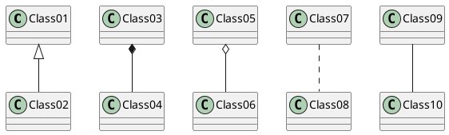

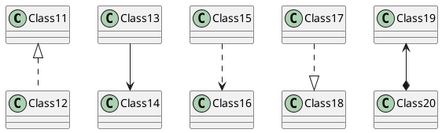

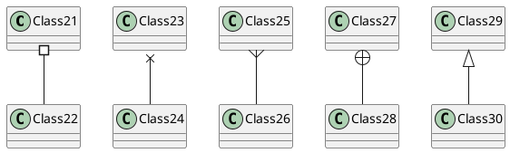


## Label on relations


It is possible to add a label on the relation, using ``:``, followed
by the text of the label.

For cardinality, you can use double-quotes ``""`` on each side
of the relation.


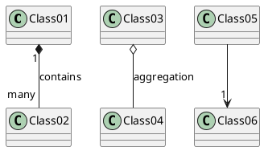

You can add an extra arrow pointing at one object showing
which object acts on the other object, using ``<`` or ``>``
at the begin or at the end of the label.


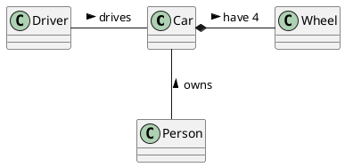


## Using non-letters in element names and relation labels


If you want to use [non-letters](unicode) in the class (or enum...) display name, you can either :
* Use the ``as`` keyword in the class definition to assign an alias
* Put quotes ``""`` around the class name

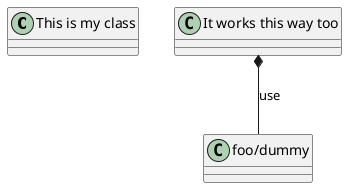

If an alias is assigned to an element, the rest of the file must refer to the element by the alias instead of the name.

### Starting names with ``$``
Note that names starting with ``$`` cannot be hidden or removed later, because ``hide`` and ``remove`` command will consider the name a ``$tag`` instead of a component name. To later remove such elements they must have an alias or must be tagged.
```plantuml
@startuml
class $C1
class $C2 $C2
class "$C2" as dollarC2
remove $C1
remove $C2
remove dollarC2
@enduml
```
Also note that names starting with ``$`` are valid, but to assign an alias to such element the name must be put between quotes ``""``.


## Adding methods

To declare fields and methods, you can use the symbol
``:`` followed by the field's or method's name.

The system checks for parenthesis to choose between methods and fields.

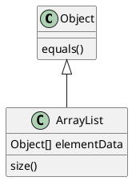


It is also possible to group between brackets
``{}`` all fields and methods.

Note that the syntax is highly flexible about type/name order.


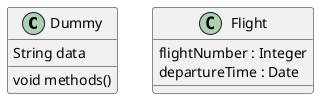

You can use ``{field}`` and ``{method}`` modifiers to
override default behaviour of the parser about fields and methods.
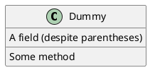


## Defining visibility

### Visibility for methods or fields
When you define methods or fields, you can use characters to define the
visibility of the corresponding item:

| Character | Icon for field                 | Icon for method                 | Visibility          |
| --------- | ------------------------------ | ------------------------------- | ------------------- |
| ``-``     |          |          | ``private``         |
| ``#``     |        |        | ``protected``       |
| ``~``     |  |  | ``package private`` |
| ``+``     |           |           | ``public``          |

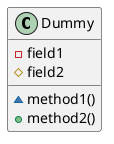


You can turn off this feature using the ``skinparam classAttributeIconSize 0`` command :


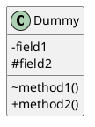

Visibility indicators are optional and can be ommitted individualy without turning off the icons globally using `skinparam classAttributeIconSize 0`.

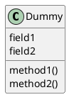

In such case if you'd like to use methods or fields that start with `-`, `#`, `~` or `+` characters such as a destructor in some languages for `Dummy` class `~Dummy()`, escape the first character with a `\\` character:


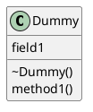


### Visibility for class

Similar to methods or fields, you can use same characters to define the Class visibility:
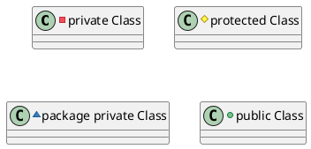

*[Ref. [QA-4755](https://forum.plantuml.net/4755/provide-display-visibility-attributes-private-protected)]*


## Visibility on compositions and aggregations

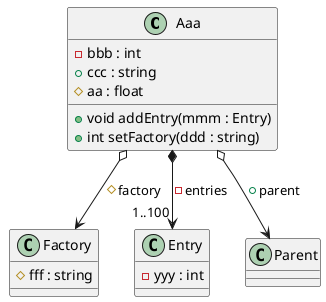

*[Ref. [QA-8294](https://forum.plantuml.net/8294/support-visibility-on-compositions-and-aggregations)]*


## Abstract and Static


You can define static or abstract methods or fields using the ``{static}``
or  ``{abstract}`` modifier.

These modifiers can be used at the start or at the end of the line.
You can also use ``{classifier}`` instead of ``{static}``.

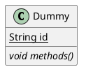


## Advanced class body


By default, methods and fields are automatically regrouped by PlantUML.
You can use separators to define your own way of ordering fields and methods.
The following separators are possible : ``--`` ``..`` ``==`` ``__``.

You can also use titles within the separators:


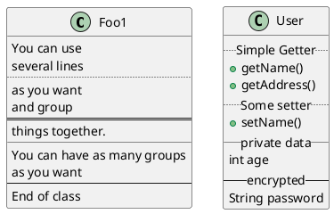


## Notes and stereotypes

Stereotypes are defined with the ``class`` keyword, ``<<`` and ``>>``.

You can also define notes using ``note left of`` , ``note right of`` , ``note top of`` , ``note bottom of``
keywords.

You can also define a note on the last defined element using ``note left``, ``note right``,
``note top``, ``note bottom``.

A note can be also define alone with the ``note``
keywords, then linked to other objects using the ``..`` symbol.

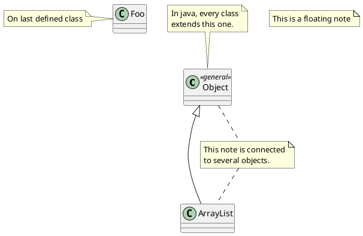


## More on notes


It is also possible to use few HTML tags (See [Creole expression](creole)) like :

* ``<b>``
* ``<u>``
* ``<i>``
* ``<s>``, ``<del>``, ``<strike>``
* ``<font color="#AAAAAA">`` or ``<font color="colorName">``
* ``<color:#AAAAAA>`` or ``<color:colorName>``
* ``<size:nn>`` to change font size
* ```` or ````: the file must be accessible by the filesystem


You can also have a note on several lines.

You can also define a note on the last defined element using ``note left``, ``note right``,
``note top``, ``note bottom``.
```plantuml
@startuml

class Foo
note left: On last defined class

note top of Foo
  In java, <size:18>every</size> <u>class</u>
  <b>extends</b>
  <i>this</i> one.
end note

note as N1
  This note is <u>also</u>
  <b><color:royalBlue>on several</color>
  <s>words</s> lines
  And this is hosted by 
end note

@enduml
```


## Note on field (field, attribute, member) or method


It is possible to add a note on field (field, attribute, member) or on method.

### ⚠ Constraint
* This cannot be used with ``top`` or ``bottom`` *(only ``left`` and ``right`` are implemented)*
* This cannot be used with namespaceSeparator ``::``


### Note on field or method

```plantuml
@startuml
class A {
{static} int counter
+void {abstract} start(int timeout)
}
note right of A::counter
  This member is annotated
end note
note right of A::start
  This method is now explained in a UML note
end note
@enduml
```


### Note on method with the same name

```plantuml
@startuml
class A {
{static} int counter
+void {abstract} start(int timeoutms)
+void {abstract} start(Duration timeout)
}
note left of A::counter
  This member is annotated
end note
note right of A::"start(int timeoutms)"
  This method with int
end note
note right of A::"start(Duration timeout)"
  This method with Duration
end note
@enduml
```

*[Ref. [QA-3474](https://forum.plantuml.net/3474) and [QA-5835](https://forum.plantuml.net/5835)]*


## Note on links


It is possible to add a note on a link, just after the link definition, using ``note on link``.

You can also use ``note left on link``, ``note right on link``, ``note top on link``,
``note bottom on link`` if you want to change the relative position of the note with the label.

```plantuml
@startuml

class Dummy
Dummy --> Foo : A link
note on link #red: note that is red

Dummy --> Foo2 : Another link
note right on link #blue
this is my note on right link
and in blue
end note

@enduml
```


## Abstract class and interface


You can declare a class as abstract using ``abstract`` or ``abstract class`` keywords.

The class will be printed in *italic*.


You can use the ``interface``, ``annotation`` and ``enum`` keywords too.

```plantuml
@startuml

abstract class AbstractList
abstract AbstractCollection
interface List
interface Collection

List <|-- AbstractList
Collection <|-- AbstractCollection

Collection <|- List
AbstractCollection <|- AbstractList
AbstractList <|-- ArrayList

class ArrayList {
  Object[] elementData
  size()
}

enum TimeUnit {
  DAYS
  HOURS
  MINUTES
}

annotation SuppressWarnings

annotation Annotation {
  annotation with members
  String foo()
  String bar()
}


@enduml
```

*[Ref. 'Annotation with members' [Issue#458](https://github.com/plantuml/plantuml/issues/458)]*


## Hide attributes, methods...

You can parameterize the display of classes using the ``hide/show``
command.

The basic command is: ``hide empty members``. This
command will hide attributes or methods if they are empty.

Instead of ``empty members``, you can use:
* ``empty fields`` or ``empty attributes`` for empty fields,
* ``empty methods`` for empty methods,
* ``fields`` or ``attributes`` which will hide fields, even if they are described,
* ``methods`` which will hide methods, even if they are described,
* ``members`` which will hide fields __and__ methods, even if they are described,
* ``circle`` for the circled character in front of class name,
* ``stereotype`` for the stereotype.

You can also provide, just after the ``hide`` or ``show``
keyword:
* ``class`` for all classes,
* ``interface`` for all interfaces,
* ``enum`` for all enums,
* ``<<foo1>>`` for classes which are stereotyped with *foo1*,
* an existing class name.

You can use several ``show/hide`` commands to define rules and
exceptions.

```plantuml
@startuml

class Dummy1 {
  +myMethods()
}

class Dummy2 {
  +hiddenMethod()
}

class Dummy3 <<Serializable>> {
String name
}

hide members
hide <<Serializable>> circle
show Dummy1 methods
show <<Serializable>> fields

@enduml
```

You can also mix with visibility:

```plantuml
@startuml
hide private members
hide protected members
hide package members

class Foo {
  - private
  # protected
  ~ package
}
@enduml
```
*[Ref. [QA-2913](https://forum.plantuml.net/2913/hiding-based-on-visibilty?show=2916#a2916)]*


## Hide classes

You can also use the ``show/hide`` commands to hide classes.

This may be useful if you define a large [!included file](preprocessing),
and if you want to hide some classes after [file inclusion](preprocessing).

```plantuml
@startuml

class Foo1
class Foo2

Foo2 *-- Foo1

hide Foo2

@enduml
```


## Remove classes

You can also use the ``remove`` commands to remove classes.

This may be useful if you define a large [!included file](preprocessing),
and if you want to remove some classes after [file inclusion](preprocessing).

```plantuml
@startuml

class Foo1
class Foo2

Foo2 *-- Foo1

remove Foo2

@enduml
```


## Hide, Remove or Restore tagged element or wildcard

You can put `$tags` (using `$`) on elements, then remove, hide or restore components either individually or by tags.

By default, all components are displayed:
```plantuml
@startuml
class C1 $tag13
enum E1
interface I1 $tag13
C1 -- I1
@enduml
```

But you can:
* `hide $tag13` components:
```plantuml
@startuml
class C1 $tag13
enum E1
interface I1 $tag13
C1 -- I1

hide $tag13
@enduml
```

* or `remove $tag13` components:
```plantuml
@startuml
class C1 $tag13
enum E1
interface I1 $tag13
C1 -- I1

remove $tag13
@enduml
```

* or `remove $tag13 and restore $tag1` components:
```plantuml
@startuml
class C1 $tag13 $tag1
enum E1
interface I1 $tag13
C1 -- I1

remove $tag13
restore $tag1
@enduml
```

* or ``remove * and restore $tag1`` components:
```plantuml
@startuml
class C1 $tag13 $tag1
enum E1
interface I1 $tag13
C1 -- I1

remove *
restore $tag1
@enduml
```


## Hide or Remove unlinked class

By default, all classes are displayed:
```plantuml
@startuml
class C1
class C2
class C3
C1 -- C2
@enduml
```

But you can:
* `hide @unlinked` classes:
```plantuml
@startuml
class C1
class C2
class C3
C1 -- C2

hide @unlinked
@enduml
```

* or `remove @unlinked` classes:
```plantuml
@startuml
class C1
class C2
class C3
C1 -- C2

remove @unlinked
@enduml
```


*[Adapted from [QA-11052](https://forum.plantuml.net/11052)]*


## Use generics


You can also use bracket ``<`` and ``>`` to define generics usage in a class.

```plantuml
@startuml

class Foo<? extends Element> {
  int size()
}
Foo *- Element

@enduml
```

It is possible to disable this drawing using ``skinparam genericDisplay old`` command.


## Specific Spot

Usually, a spotted character (C, I, E or A) is used for classes,
interface, enum and abstract classes.

But you can define your own spot for a class when you define the stereotype,
adding a single character and a color, like in this example:

```plantuml
@startuml

class System << (S,#FF7700) Singleton >>
class Date << (D,orchid) >>
@enduml
```


## Packages

You can define a package using the
``package`` keyword, and optionally declare a background color
for your package (Using a html color code or name).

Note that package definitions can be nested.

```plantuml
@startuml

package "Classic Collections" #DDDDDD {
  Object <|-- ArrayList
}

package com.plantuml {
  Object <|-- Demo1
  Demo1 *- Demo2
}

@enduml
```


## Packages style


There are different styles available for packages.

You can specify them either by setting a default style with the command : ``skinparam packageStyle``,
or by using a stereotype on the package:

```plantuml
@startuml
scale 750 width
package foo1 <<Node>> {
  class Class1
}

package foo2 <<Rectangle>> {
  class Class2
}

package foo3 <<Folder>> {
  class Class3
}

package foo4 <<Frame>> {
  class Class4
}

package foo5 <<Cloud>> {
  class Class5
}

package foo6 <<Database>> {
  class Class6
}

@enduml
```


You can also define links between packages, like in the following
example:

```plantuml
@startuml

skinparam packageStyle rectangle

package foo1.foo2 {
}

package foo1.foo2.foo3 {
  class Object
}

foo1.foo2 +-- foo1.foo2.foo3

@enduml
```


## Namespaces

Starting with version 1.2023.2 (which is online as a beta), PlantUML handles differently namespaces and packages.

There won't be any difference between namespaces and packages anymore: both keywords are now synonymous. 


## Automatic package creation


You can define another separator (other than the dot) using
the command : ``set separator ???``.

```plantuml
@startuml

set separator ::
class X1::X2::foo {
  some info
}

@enduml
```

You can disable automatic namespace creation using the command
``set separator none``.

```plantuml
@startuml

set separator none
class X1.X2.foo {
  some info
}

@enduml
```


## Lollipop interface


You can also define lollipops interface on classes, using the following
syntax:
* ``bar ()- foo``
* ``bar ()-- foo``
* ``foo -() bar``

```plantuml
@startuml
class foo
bar ()- foo
@enduml
```


## Changing arrows orientation

By default, links between classes have two dashes ``--`` and are vertically oriented.
It is possible to use horizontal link by putting a single dash (or dot) like this:

```plantuml
@startuml
Room o- Student
Room *-- Chair
@enduml
```

You can also change directions by reversing the link:

```plantuml
@startuml
Student -o Room
Chair --* Room
@enduml
```

It is also possible to change arrow direction by adding ``left``, ``right``, ``up``
or ``down`` keywords inside the arrow:

```plantuml
@startuml
foo -left-> dummyLeft
foo -right-> dummyRight
foo -up-> dummyUp
foo -down-> dummyDown
@enduml
```

You can shorten the arrow by using only the first character of the direction (for example, ``-d-`` instead of
``-down-``)
or the two first characters (``-do-``).

Please note that you should not abuse this functionality : *Graphviz* gives usually good results without tweaking.

And with the [``left to right direction``](use-case-diagram#d551e48d272b2b07) parameter: 
```plantuml
@startuml
left to right direction
foo -left-> dummyLeft
foo -right-> dummyRight
foo -up-> dummyUp
foo -down-> dummyDown
@enduml
```


## Association classes

You can define *association class* after that a relation has been
defined between two classes, like in this example:
```plantuml
@startuml
class Student {
  Name
}
Student "0..*" - "1..*" Course
(Student, Course) .. Enrollment

class Enrollment {
  drop()
  cancel()
}
@enduml
```

You can define it in another direction:

```plantuml
@startuml
class Student {
  Name
}
Student "0..*" -- "1..*" Course
(Student, Course) . Enrollment

class Enrollment {
  drop()
  cancel()
}
@enduml
```


## Association on same class

```plantuml
@startuml
class Station {
    +name: string
}

class StationCrossing {
    +cost: TimeInterval
}

<> diamond

StationCrossing . diamond
diamond - "from 0..*" Station
diamond - "to 0..* " Station
@enduml
```

*[Ref. [Incubation: Associations](http://wiki.plantuml.net/site/incubation#associations)]*


## Skinparam


You can use the [skinparam](skinparam)
command to change colors and fonts for the drawing.

You can use this command :
* In the diagram definition, like any other commands,
* In an [included file](preprocessing),
* In a configuration file, provided in the [command line](command-line) or the [ANT task](ant-task).

```plantuml
@startuml

skinparam class {
BackgroundColor PaleGreen
ArrowColor SeaGreen
BorderColor SpringGreen
}
skinparam stereotypeCBackgroundColor YellowGreen

Class01 "1" *-- "many" Class02 : contains

Class03 o-- Class04 : aggregation

@enduml
```


## Skinned Stereotypes


You can define specific color and fonts for stereotyped classes.

```plantuml
@startuml

skinparam class {
BackgroundColor PaleGreen
ArrowColor SeaGreen
BorderColor SpringGreen
BackgroundColor<<Foo>> Wheat
BorderColor<<Foo>> Tomato
}
skinparam stereotypeCBackgroundColor YellowGreen
skinparam stereotypeCBackgroundColor<< Foo >> DimGray

class Class01 <<Foo>>
class Class03 <<Foo>>
Class01 "1" *-- "many" Class02 : contains

Class03 o-- Class04 : aggregation

@enduml
```

**Important**: unlike class stereotypes, there must be no space between the skin parameter and the following stereotype. 

Any of the spaces shown as `_` below will cause **all** skinparams to be ignored, 
see [discord discussion](https://discord.com/channels/1083727021328306236/1289954399321329755/1289967399302467614)
and [issue #1932](https://github.com/plantuml/plantuml/issues/1932):
- `BackgroundColor_<<Foo>> Wheat`
- `skinparam stereotypeCBackgroundColor_<<Foo>> DimGray`


## Color gradient

You can declare individual colors for classes, notes etc using the \# notation.

You can use standard color names or RGB codes in various notations, see [Colors](color).

You can also use color gradient for background colors, with the following syntax:
two colors names separated either by:
* ``|``,
* ``/``,
* ``\``, or 
* ``-``
depending on the direction of the gradient.

For example:

```plantuml
@startuml

skinparam backgroundcolor AntiqueWhite/Gold
skinparam classBackgroundColor Wheat|CornflowerBlue

class Foo #red-green
note left of Foo #blue\9932CC
  this is my
  note on this class
end note

package example #GreenYellow/LightGoldenRodYellow {
  class Dummy
}

@enduml
```


## Help on layout


Sometimes, the default layout is not perfect...

You can use ``together`` keyword to group some classes together :
the layout engine will try to group them (as if they were in the same package).

You can also use ``hidden`` links to force the layout.
```plantuml
@startuml

class Bar1
class Bar2
together {
  class Together1
  class Together2
  class Together3
}
Together1 - Together2
Together2 - Together3
Together2 -[hidden]--> Bar1
Bar1 -[hidden]> Bar2


@enduml
```


## Splitting large files

Sometimes, you will get some very large image files.

You can use the ``page (hpages)x(vpages)`` command to split the generated image into several files :

``hpages`` is a number that indicated the number of horizontal pages,
and ``vpages`` is a number that indicated the number of vertical pages.

You can also use some specific skinparam settings to put borders on splitted pages (see example).

```plantuml
@startuml
' Split into 4 pages
page 2x2
skinparam pageMargin 10
skinparam pageExternalColor gray
skinparam pageBorderColor black

class BaseClass

namespace net.dummy #DDDDDD {
    .BaseClass <|-- Person
    Meeting o-- Person

    .BaseClass <|- Meeting

}

namespace net.foo {
  net.dummy.Person  <|- Person
  .BaseClass <|-- Person

  net.dummy.Meeting o-- Person
}

BaseClass <|-- net.unused.Person
@enduml
```


## Ext