## Object Diagram

An **object diagram** is a graphical representation that showcases objects and their relationships at a specific moment in time. It provides a snapshot of the system's structure, capturing the static view of the instances present and their associations. 

**PlantUML** offers a simple and intuitive way to create object diagrams using plain text. Its user-friendly syntax allows for quick diagram creation without the need for complex GUI tools. Moreover, the [PlantUML forum](https://forum.plantuml.net/) provides a platform for users to discuss, share, and seek assistance, fostering a collaborative community. By choosing PlantUML, users benefit from both the efficiency of markdown-based diagramming and the support of an active community.

## Definition of objects

You define instances of objects using the ``object``
keyword.

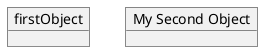

## Relations between objects

Relations between objects are defined using the following symbols :

| Type           | Symbol   | Purpose                                       |
| -------------- | -------- | --------------------------------------------- |
| Extension      | ``<|--`` | Specialization of a class in a hierarchy      |
| Implementation | ``<|..`` | Realization of an interface by a class        |
| Composition    | ``*--``  | The part cannot exist without the whole       |
| Aggregation    | ``o--``  | The part can exist independently of the whole |
| Dependency     | ``-->``  | The object uses another object                |
| Dependency     | ``..>``  | A weaker form of dependency                   |

It is possible to replace ``--`` by ``..`` to have a dotted line.

Knowing those rules, it is possible to draw the following drawings.

It is possible a add a label on the relation, using ``:`` followed by the text of the label.

For cardinality, you can use double-quotes ``""`` on
each side of the relation.

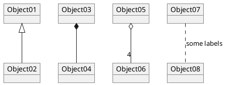

## Associations objects

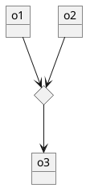

## Adding fields

To declare fields, you can use the symbol ``:`` followed by
the field's name.

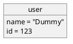

It is also possible to group all fields between brackets ``{}``.

## Common features with class diagrams

* [Hide attributes, methods...](class-diagram#Hide)
* [Defines notes](class-diagram#Notes)
* [Use packages](class-diagram#Using)
* [Skin the output](class-diagram#Skinparam)

## Map table or associative array

You can define a map table or [associative array](https://en.wikipedia.org/wiki/Associative_array), with `map` keyword and `=>` separator.
 
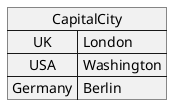

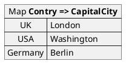

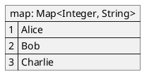

And add link with object.
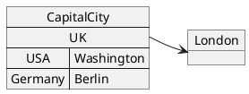

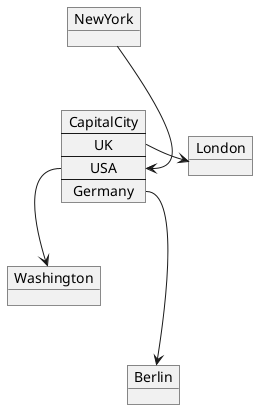
*[Ref. [#307](https://github.com/plantuml/plantuml/issues/307)]*

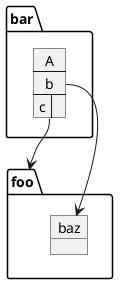
*[Ref. [QA-12934](https://forum.plantuml.net/12934)]*

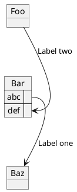
*[Ref. [#307](https://github.com/plantuml/plantuml/issues/307)]*

## Program (or project) evaluation and review technique (PERT) with map

You can use `map table` in order to make [Program (or project) evaluation and review technique (PERT)](https://en.wikipedia.org/wiki/Program_evaluation_and_review_technique) diagram.

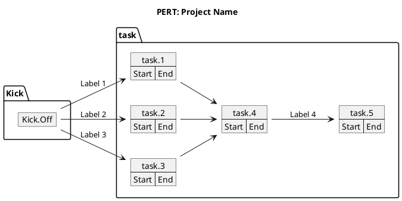
*[Ref. [QA-12337](https://forum.plantuml.net/12337/there-any-support-for-pert-style-project-management-diagrams?show=14426#a14426)]*

## Display JSON Data on Class or Object diagram

### Simple example
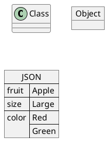

*[Ref. [QA-15481](https://forum.plantuml.net/15481/possible-link-elements-from-two-jsons-with-both-jsons-embeded?show=15567#c15567)]*

For another example, see on [JSON page](json#jinnkhaa7d65l0fkhfec).

