## Sequence Diagram

PlantUML streamlines the creation of sequence diagrams through its intuitive and user-friendly syntax. This approach allows both novices and experienced designers to quickly transition from concept to a polished graphical output.

- **Intuitive syntax:**  
  The syntax of PlantUML is designed for ease of use, ensuring that users can grasp the fundamentals with minimal effort. This clarity reduces the learning curve and accelerates the diagram creation process.

- **Direct Text-to-Graphic translation:**  
  There is a direct correlation between the textual input and the resulting diagram. This consistency guarantees that the visual output closely mirrors the initial draft, minimizing unexpected discrepancies and streamlining the workflow.

- **Efficient workflow:**  
  The close relationship between text and image not only simplifies the design process but also speeds it up. By reducing the need for extensive revisions, users can focus on refining their diagrams with greater efficiency.

- **Real-time visualization:**  
  The ability to visualize the final outcome while drafting the text enhances productivity. This immediate feedback loop helps in identifying and correcting errors early, ensuring a smoother transition from concept to completion.

- **Seamless edits and revisions:**  
  Editing is straightforward when working with text-based diagrams. Adjustments can be made directly in the source text, eliminating the complexities and potential errors associated with graphical editing tools.

In summary, PlantUML offers a robust and efficient approach to sequence diagram creation. Its emphasis on simplicity and precision makes it an invaluable asset for anyone looking to produce clear and accurate diagrams with ease.

For further enhancement of your diagram creation experience, please refer to the [common commands in PlantUML](commons).


## Basic Examples

In PlantUML sequence diagrams, the `->` sequence denotes a message sent between two participants, which are automatically recognized and do not need to be declared beforehand.

Utilize dotted arrows by employing the `-->` sequence, offering a distinct visualization in your diagrams.

To improve readability without affecting the visual representation, use reverse arrows like `<-` or `<--`. However, be aware that this is specifically for sequence diagrams and the rules differ for other diagram types.


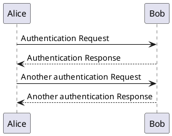


## Declaring participant

If the keyword ``participant`` is used to declare a participant, more control on that participant is possible.

The order of declaration will be the (default) **order of display**.

Using these other keywords to declare participants will **change the shape** of the participant representation:
* ``actor``
* ``boundary``
* ``control``
* ``entity``
* ``database``
* ``collections``
* ``queue``

Syntax:

``<participant_type> <label> as <alias>``

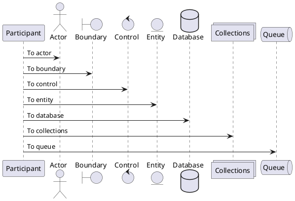

Rename a participant using the ``as`` keyword.

You can also change the background [color](color) of
actor or participant.

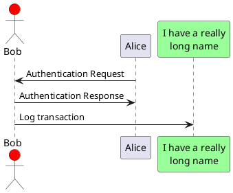

You can use the ``order`` keyword to customize the display order of participants.

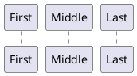


## Declaring participant on multiline

You can declare participant on multi-line.

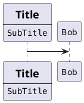

*[Ref. [QA-15232](https://forum.plantuml.net/15232/)]*


## Use non-letters in participants


You can use quotes to define participants.
And you can use the ``as`` keyword to give an alias to those participants.
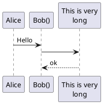


## Message to Self

A participant can send a message to itself.

It is also possible to have multi-line using ``\n``.

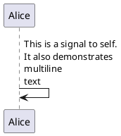

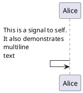
*[Ref. [QA-1361](https://forum.plantuml.net/1361)]*


## Text alignment

Text alignment on arrows can be set to ``left``, ``right`` or ``center`` using ``skinparam sequenceMessageAlign``. 

You can also use ``direction`` or ``reverseDirection`` to align text depending on arrow direction. Further details and examples of this are available on the [skinparam](skinparam) page.

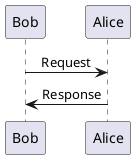

### Text of response message below the arrow

You can put the text of the response message below the arrow, with the ``skinparam responseMessageBelowArrow true`` command.

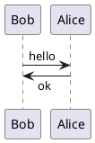


## Change Actor style

You can change the actor style from stick man *(by default)* to:
* an awesome man with the `skinparam actorStyle awesome` command;
* a hollow man with the `skinparam actorStyle hollow ` command.

### Stick man *(by default)*
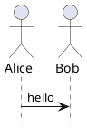

### Awesome man 
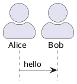

*[Ref. [QA-10493](https://forum.plantuml.net/10493/how-can-i-customize-the-actor-icon-in-svg-output?show=10513#c10513)]*

### Hollow man 
```plantuml
@startuml
skinparam actorStyle Hollow
actor Alice
actor Bob
Alice -> Bob : hello
hide footbox
@enduml
```

*[Ref. [PR#396](https://github.com/plantuml/plantuml/pull/396)]*


## Change arrow style

You can change arrow style by several ways:
* add a final ``x`` to denote a lost message
* use ``\`` or ``/`` instead of ``<`` or ``>`` to have only the bottom or top part of the arrow
* repeat the arrow head (for example, ``>>`` or ``//``) head to have a thin drawing
* use ``--`` instead of ``-`` to have a dotted arrow
* add a final "o" at arrow head
* use bidirectional arrow ``<->``

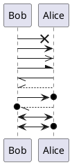


## Change arrow color

You can change the color of individual arrows using the following notation:
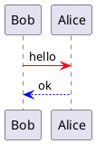


## Message sequence numbering


The keyword ``autonumber`` is used to
automatically add an incrementing number to messages.

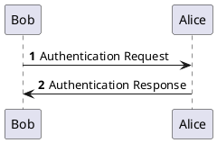

You can specify a startnumber with ``autonumber <start>`` , and
also an increment with ``autonumber <start> <increment>``.


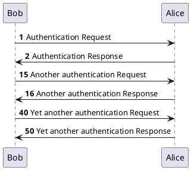


You can specify a format for your number by using between double-quote.

The formatting is done with the Java class ``DecimalFormat``
(``0`` means digit, ``#`` means digit and zero if absent).

You can use some html tag in the format.
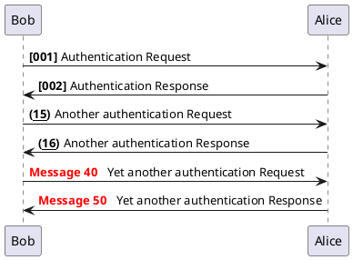

You can also use ``autonumber stop`` and
``autonumber resume <increment> <format>`` to respectively pause and resume
automatic numbering.

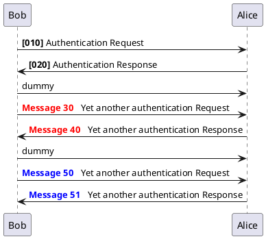

Your startnumber can also be a 2 or 3 digit sequence using a field delimiter such as ``.``, ``;``, ``,``, ``:`` or a mix of these. For example: ``1.1.1`` or ``1.1:1``.

Automatically the last digit will increment.

To increment the first digit, use: ``autonumber inc A``. To increment the second digit, use: ``autonumber inc B``. 

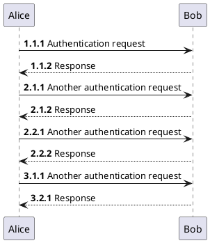


You can also use the value of `autonumber` with the ``%autonumber%`` variable:
```plantuml
@startuml
autonumber 10
Alice -> Bob
note right
  the <U+0025>autonumber<U+0025> works everywhere.
  Here, its value is ** %autonumber% **
end note
Bob --> Alice: //This is the response %autonumber%//
@enduml
```
*[Ref. [QA-7119](https://forum.plantuml.net/7119/create-links-after-creating-a-diagram?show=7137#a7137)]*


## Page Title, Header and Footer

The ``title`` keyword is used to add a title to the page.

Pages can display headers and footers using ``header`` and ``footer``.

```plantuml
@startuml

header Page Header
footer Page %page% of %lastpage%

title Example Title

Alice -> Bob : message 1
Alice -> Bob : message 2

@enduml
```


## Splitting diagrams

### With `newpage`

The ``newpage`` keyword is used to split a diagram into several images.

You can put a title for the new page just after the ``newpage``
keyword.  This title overrides the previously specified title if any.

This is very handy with *Word* to print long diagram on
several pages.

(Note: this really does work.  Only the first page is shown below, but it is a display artifact.)

```plantuml
@startuml

Alice -> Bob : message 1
Alice -> Bob : message 2

newpage

Alice -> Bob : message 3
Alice -> Bob : message 4

newpage A title for the\nlast page

Alice -> Bob : message 5
Alice -> Bob : message 6
@enduml
```

### `%page%` and `%lastpage%` variables

```plantuml
@startuml
footer This is %page% of %lastpage%
Alice --> Bob : A1
newpage
Alice --> Bob : A2
newpage
Alice --> Bob : A3
newpage
Alice --> Bob : A4
@enduml
```

*[Ref. [QA-6699](https://forum.plantuml.net/6699/please-provide-macros-insert-current-number-total-number-pages)]*

### Ignore newpage

You can use the ``ignore newpage`` command to show all the pages, as if there was no newpage.
```plantuml
@startuml

ignore newpage

Alice -> Bob : message 1
Alice -> Bob : message 2

newpage

Alice -> Bob : message 3
Alice -> Bob : message 4

newpage A title for the\nlast page

Alice -> Bob : message 5
Alice -> Bob : message 6
@enduml
```


## Grouping message


It is possible to group messages together using the following
keywords:
* ``alt/else``
* ``opt``
* ``loop``
* ``par``
* ``break``
* ``critical``
* ``group``, followed by a text to be displayed


It is possible to add a text that will be displayed into the
header (for ``group``, see next paragraph *'Secondary group label'*).

The ``end`` keyword is used to close the group.

Note that it is possible to nest groups.

```plantuml
@startuml
Alice -> Bob: Authentication Request

alt successful case

    Bob -> Alice: Authentication Accepted

else some kind of failure

    Bob -> Alice: Authentication Failure
    group My own label
    Alice -> Log : Log attack start
        loop 1000 times
            Alice -> Bob: DNS Attack
        end
    Alice -> Log : Log attack end
    end

else Another type of failure

   Bob -> Alice: Please repeat

end
@enduml
```


## Secondary group label

For `group`, it is possible to add, between`[` and `]`, a secondary text or label that will be displayed into the header.

```plantuml
@startuml
Alice -> Bob: Authentication Request
Bob -> Alice: Authentication Failure
group My own label [My own label 2]
    Alice -> Log : Log attack start
    loop 1000 times
        Alice -> Bob: DNS Attack
    end
    Alice -> Log : Log attack end
end
@enduml
```

*[Ref. [QA-2503](https://forum.plantuml.net/2503)]*


## Partition across the entire width

You can use ``partition`` command to group messages horizontally across the entire width (full-width).

### Messages are not grouped horizontally across the entire width _(by default)_
```plantuml
@startuml
participant a

partition p1
b -> c: msg
c --> b: OK
note right: Some right note
end

partition p2
a -> b: msg
note left: Some left note
end
@enduml
```

### Grouping messages horizontally across the entire width (with ``teoz`` mode)
```plantuml
@startuml
!pragma teoz true
participant a

partition p1
b -> c: msg
c --> b: OK
note right: Some right note
end

partition p2
a -> b: msg
note left: Some left note
end
@enduml
```

*[Ref. [GH-589](https://github.com/plantuml/plantuml/issues/589)]*


## Notes on messages

It is possible to put notes on message using the ``note left``
or ``note right`` keywords *just after the message*.

You can have a multi-line note using the ``end note``
keywords.

```plantuml
@startuml
Alice->Bob : hello
note left: this is a first note

Bob->Alice : ok
note right: this is another note

Bob->Bob : I am thinking
note left
a note
can also be defined
on several lines
end note
@enduml
```


## Some other notes


It is also possible to place notes relative to participant with ``note left of`` , ``note right of`` or ``note over`` keywords.

It is possible to highlight a note by changing its background [color](color).

You can also have a multi-line note using the ``end note`` keywords.

```plantuml
@startuml
participant Alice
participant Bob
note left of Alice #aqua
This is displayed
left of Alice.
end note

note right of Alice: This is displayed right of Alice.

note over Alice: This is displayed over Alice.

note over Alice, Bob #FFAAAA: This is displayed\n over Bob and Alice.

note over Bob, Alice
This is yet another
example of
a long note.
end note
@enduml
```


## Changing notes shape [hnote, rnote]

You can use ``hnote`` and ``rnote`` keywords
to change note shapes :
* ``hnote`` for hexagonal note;
* ``rnote`` for rectangle note.
```plantuml
@startuml
caller -> server : conReq
hnote over caller : idle
caller <- server : conConf
rnote over server
 "r" as rectangle
 "h" as hexagon
endrnote
rnote over server
 this is
 on several
 lines
endrnote
hnote over caller
 this is
 on several
 lines
endhnote
@enduml
```

*[Ref. [QA-1765](https://forum.plantuml.net/1765/is-it-possible-to-have-different-shapes-for-notes?show=1806#c1806)]*


## Note over all participants [across]

You can directly make a note over all participants, with the syntax:
* `note across: note_description`

```plantuml
@startuml
Alice->Bob:m1
Bob->Charlie:m2
note over Alice, Charlie: Old method for note over all part. with:\n ""note over //FirstPart, LastPart//"".
note across: New method with:\n""note across""
Bob->Alice
hnote across:Note across all part.
@enduml
```

*[Ref. [QA-9738](https://forum.plantuml.net/9738)]*


## Several notes aligned at the same level [/]

You can make several notes aligned at the same level, with the syntax `/`:
* without `/` *(by default, the notes are not aligned)*
```plantuml
@startuml
note over Alice : initial state of Alice
note over Bob : initial state of Bob
Bob -> Alice : hello
@enduml
```

* with `/` *(the notes are aligned)*
```plantuml
@startuml
note over Alice : initial state of Alice
/ note over Bob : initial state of Bob
Bob -> Alice : hello
@enduml
```

*[Ref. [QA-354](https://forum.plantuml.net/354)]*


## Creole and HTML

[It is also possible to use creole formatting:](creole)

```plantuml
@startuml
participant Alice
participant "The **Famous** Bob" as Bob

Alice -> Bob : hello --there--
... Some ~~long delay~~ ...
Bob -> Alice : ok
note left
  This is **bold**
  This is //italics//
  This is ""monospaced""
  This is --stroked--
  This is __underlined__
  This is ~~waved~~
end note

Alice -> Bob : A //well formatted// message
note right of Alice
 This is <back:cadetblue><size:18>displayed</size></back>
 __left of__ Alice.
end note
note left of Bob
 <u:red>This</u> is <color #118888>displayed</color>
 **<color purple>left of</color> <s:red>Alice</strike> Bob**.
end note
note over Alice, Bob
 <w:#FF33FF>This is hosted</w> by 
end note
@enduml
```


## Divider or separator


If you want, you can split a diagram using ``==`` separator to
divide your diagram into logical steps.
```plantuml
@startuml

== Initialization ==

Alice -> Bob: Authentication Request
Bob --> Alice: Authentication Response

== Repetition ==

Alice -> Bob: Another authentication Request
Alice <-- Bob: another authentication Response

@enduml
```


## Reference

You can use reference in a diagram, using the keyword ``ref over``.
```plantuml
@startuml
participant Alice
actor Bob

ref over Alice, Bob : init

Alice -> Bob : hello

ref over Bob
  This can be on
  several lines
end ref
@enduml
```


## Delay

You can use ``...`` to indicate a delay in the diagram.
And it is also possible to put a message with this delay.
```plantuml
@startuml

Alice -> Bob: Authentication Request
...
Bob --> Alice: Authentication Response
...5 minutes later...
Bob --> Alice: Good Bye !

@enduml
```


## Text wrapping

To break long messages, you can manually add ``\n`` in your text.

Another option is to use ``maxMessageSize`` setting:

```plantuml
@startuml
skinparam maxMessageSize 50
participant a
participant b
a -> b :this\nis\nmanually\ndone
a -> b :this is a very long message on several words
@enduml
```


## Message text spans beyond the involved participants

You can use ``sequenceMessageSpan`` command to allow message text to span beyond the involved participants.

### Without ``sequenceMessageSpan`` _(by default)_
```plantuml
@startuml
ParticipantNumber1 -> ParticipantNumber2 : this is a very long message that is very long
ParticipantNumber1 -> ParticipantNumber1 : this is a very long message that is very long 
ParticipantNumber2 -> ParticipantNumber3 : foo2
@enduml
```

### With  ``sequenceMessageSpan`` (on ``teoz`` mode)
```plantuml
@startuml
!pragma teoz true
!pragma sequenceMessageSpan true

ParticipantNumber1 -> ParticipantNumber2 : this is a very long message that is very long
ParticipantNumber1 -> ParticipantNumber1 : this is a very long message that is very long 
ParticipantNumber2 -> ParticipantNumber3 : foo2
@enduml
```

*[Ref. [GH-2386](https://github.com/plantuml/plantuml/issues/2386)]*


## Space


You can use ``|||`` to indicate some spacing in the diagram.

It is also possible to specify a number of pixel to be used.
```plantuml
@startuml

Alice -> Bob: message 1
Bob --> Alice: ok
|||
Alice -> Bob: message 2
Bob --> Alice: ok
||45||
Alice -> Bob: message 3
Bob --> Alice: ok

@enduml
```


## Lifeline Activation and Destruction

The ``activate`` and ``deactivate`` are used to denote
participant activation.

Once a participant is activated, its lifeline appears.

The ``activate`` and ``deactivate`` apply on
the previous message.

The ``destroy`` denote the end of the lifeline of a
participant.

```plantuml
@startuml
participant User

User -> A: DoWork
activate A

A -> B: << createRequest >>
activate B

B -> C: DoWork
activate C
C --> B: WorkDone
destroy C

B --> A: RequestCreated
deactivate B

A -> User: Done
deactivate A

@enduml
```


Nested lifeline can be used, and it is possible to add a [color](color) on the lifeline.

```plantuml
@startuml
participant User

User -> A: DoWork
activate A #FFBBBB

A -> A: Internal call
activate A #DarkSalmon

A -> B: << createRequest >>
activate B

B --> A: RequestCreated
deactivate B
deactivate A
A -> User: Done
deactivate A

@enduml
```

Autoactivation is possible and works with the return keywords:

```plantuml
@startuml
autoactivate on
alice -> bob : hello
bob -> bob : self call
bill -> bob #005500 : hello from thread 2
bob -> george ** : create
return done in thread 2
return rc
bob -> george !! : delete
return success

@enduml
```


## Return

Command ``return`` generates a return message with optional text label.

The return point is that which caused the most recent life-line activation.

The syntax is ``return label`` where ``label`` if provided is any string acceptable for conventional messages.


```plantuml
@startuml
Bob -> Alice : hello
activate Alice
Alice -> Alice : some action
return bye
@enduml
```


## Participant creation


You can use the ``create`` keyword just before the first
reception of a message to emphasize the fact that this message is
actually *creating* this new object.
```plantuml
@startuml
Bob -> Alice : hello

create Other
Alice -> Other : new

create control String
Alice -> String
note right : You can also put notes!

Alice --> Bob : ok

@enduml
```


## Shortcut syntax for activation, deactivation, creation


Immediately after specifying the target participant, the following syntax can be used:

* ``++`` Activate the target (optionally a [color](color) may follow this)
* ``--`` Deactivate the source
* ``**`` Create an instance of the target
* ``!!`` Destroy an instance of the target

```plantuml
@startuml
alice -> bob ++ : hello
bob -> bob ++ : self call
bob -> bib ++  #005500 : hello
bob -> george ** : create
return done
return rc
bob -> george !! : delete
return success
@enduml
```

Then you can mix activation and deactivation, on same line:
```plantuml
@startuml
alice   ->  bob     ++   : hello1
bob     ->  charlie --++ : hello2
charlie --> alice   --   : ok
@enduml
```

```plantuml
@startuml
alice -> bob   --++ #gold: hello
bob   -> alice --++ #gold: you too
alice -> bob   --: step1
alice -> bob   : step2
@enduml
```

*[Ref. [QA-4834](https://forum.plantuml.net/4834/activation-shorthand-for-sequence-diagrams?show=13054#c13054), [QA-9573](https://forum.plantuml.net/9573) and [QA-13234](https://forum.plantuml.net/13234)]*


## Incoming and outgoing messages

You can use incoming or outgoing arrows if you want to focus on a part
of the diagram.

Use square brackets to denote the left "``[``" or the
right "``]``" side of the diagram.
```plantuml
@startuml
[-> A: DoWork

activate A

A -> A: Internal call
activate A

A ->] : << createRequest >>

A<--] : RequestCreated
deactivate A
[<- A: Done
deactivate A
@enduml
```


You can also have the following syntax:
```plantuml
@startuml
participant Alice
participant Bob #lightblue
Alice -> Bob
Bob -> Carol
...
[-> Bob
[o-> Bob
[o->o Bob
[x-> Bob
...
[<- Bob
[x<- Bob
...
Bob ->]
Bob ->o]
Bob o->o]
Bob ->x]
...
Bob <-]
Bob x<-]

@enduml
```


## Short arrows for incoming and outgoing messages

You can have **short** arrows with using `?`.

```plantuml
@startuml
?-> Alice    : ""?->""\n**short** to actor1
[-> Alice    : ""[->""\n**from start** to actor1
[-> Bob      : ""[->""\n**from start** to actor2
?-> Bob      : ""?->""\n**short** to actor2
Alice ->]    : ""->]""\nfrom actor1 **to end**
Alice ->?    : ""->?""\n**short** from actor1
Alice -> Bob : ""->"" \nfrom actor1 to actor2
@enduml
```

*[Ref. [QA-310](https://forum.plantuml.net/310)]*


## Anchors and Duration


With ``teoz`` it is possible to add anchors to the diagram and use the anchors to specify duration time.
```plantuml
@startuml
!pragma teoz true

{start} Alice -> Bob : start doing things during duration
Bob -> Max : something
Max -> Bob : something else
{end} Bob -> Alice : finish

{start} <-> {end} : some time

@enduml
```

You can use the `-P` [command-line](command-line) option to specify the pragma:
```
java -jar plantuml.jar -Pteoz=true
```
*[Ref. [issue-582](https://github.com/plantuml/plantuml/issues/582)]*


## Stereotypes and Spots


It is possible to add stereotypes to participants using ``<<``
and ``>>``.

In the stereotype, you can add a spotted character
in a colored circle using the syntax ``(X,color)``.
```plantuml
@startuml

participant "Famous Bob" as Bob << Generated >>
participant Alice << (C,#ADD1B2) Testable >>

Bob->Alice: First message

@enduml
```

By default, the *guillemet* character is used to display the stereotype.
You can change this behavious using the skinparam ``guillemet``:

```plantuml
@startuml

skinparam guillemet false
participant "Famous Bob" as Bob << Generated >>
participant Alice << (C,#ADD1B2) Testable >>

Bob->Alice: First message

@enduml
```

```plantuml
@startuml

participant Bob << (C,#ADD1B2) >>
participant Alice << (C,#ADD1B2) >>

Bob->Alice: First message

@enduml
```


## Position of the stereotypes

It is possible to define stereotypes position (`top` or `bottom`) with the command ``skinparam stereotypePosition``.

### Top postion _(by default)_
```plantuml
@startuml
skinparam stereotypePosition top

participant A<<st1>>
participant B<<st2>>
A --> B : stereo test
@enduml
```

### Bottom postion
```plantuml
@startuml
skinparam stereotypePosition bottom

participant A<<st1>>
participant B<<st2>>
A --> B : stereo test
@enduml
```

*[Ref. [QA-18650](https://forum.plantuml.net/18650/example-related-stereotypeposition-guide-please-skinparam)]*


## More information on titles

You can use [creole formatting](creole) in the title.

```plantuml
@startuml

title __Simple__ **communication** example

Alice -> Bob: Authentication Request
Bob -> Alice: Authentication Response

@enduml
```
You can add newline using ``\n`` in the title description.
```plantuml
@startuml

title __Simple__ communication example\non several lines

Alice -> Bob: Authentication Request
Bob -> Alice: Authentication Response

@enduml
```
You can also define title on several lines using ``title``
and ``end title`` keywords.
```plantuml
@startuml

title
 <u>Simple</u> communication example
 on <i>several</i> lines and using <font color=red>html</font>
 This is hosted by 
end title

Alice -> Bob: Authentication Request
Bob -> Alice: Authentication Response

@enduml
```


## Participants encompass


It is possible to draw a box around some participants, using ``box``
and ``end box`` commands.

You can add an optional title or a
optional background color, after the ``box`` keyword.

```plantuml
@startuml

box "Internal Service" #LightBlue
participant Bob
participant Alice
end box
participant Other

Bob -> Alice : hello
Alice -> Other : hello

@enduml
```


It is also possible to nest boxes - to draw a box within a box - when using the teoz rendering engine, for example:

```plantuml
@startuml

!pragma teoz true
box "Internal Service" #LightBlue
participant Bob
box "Subteam"
participant Alice
participant John
end box

end box
participant Other

Bob -> Alice : hello
Alice -> John : hello
John -> Other: Hello

@enduml
```


## Removing Foot Boxes

You can use the ``hide footbox`` keywords to remove the foot boxes
of the diagram.

```plantuml
@startuml

hide footbox
title Foot Box removed

Alice -> Bob: Authentication Request
Bob --> Alice: Authentication Response

@enduml
```


## Skinparam


You can use the [skinparam](skinparam)
command to change colors and fonts for the drawing.


You can use this command:
* In the diagram definition, like any other commands,
* In an [included file](preprocessing),
* In a configuration file, provided in the [command line](command-line) or the [ANT task](ant-task).

You can also change other rendering parameter, as seen in the following examples:

```plantuml
@startuml
skinparam sequenceArrowThickness 2
skinparam roundcorner 20
skinparam maxmessagesize 60
skinparam sequenceParticipant underline

actor User
participant "First Class" as A
participant "Second Class" as B
participant "Last Class" as C

User -> A: DoWork
activate A

A -> B: Create Request
activate B

B -> C: DoWork
activate C
C --> B: WorkDone
destroy C

B --> A: Request Created
deactivate B

A --> User: Done
deactivate A

@enduml
```

```plantuml
@startuml
skinparam backgroundColor #EEEBDC
skinparam handwritten true

skinparam sequence {
ArrowColor DeepSkyBlue
ActorBorderColor DeepSkyBlue
LifeLineBorderColor blue
LifeLineBackgroundColor #A9DCDF

ParticipantBorderColor DeepSkyBlue
ParticipantBackgroundColor DodgerBlue
ParticipantFontName Impact
ParticipantFontSize 17
ParticipantFontColor #A9DCDF

ActorBackgroundColor aqua
ActorFontColor DeepSkyBlue
ActorFontSize 17
ActorFontName Aapex
}

actor User
participant "First Class" as A
participant "Second Class" as B
participant "Last Class" as C

User -> A: DoWork
activate A

A -> B: Create Request
activate B

B -> C: DoWork
activate C
C --> B: WorkDone
destroy C

B --> A: Request Created
deactivate B

A --> User: Done
deactivate A

@enduml
```


## Changing padding


It is possible to tune some padding settings.

```plantuml
@startuml
skinparam ParticipantPadding 20
skinparam BoxPadding 10

box "Foo1"
participant Alice1
participant Alice2
end box
box "Foo2"
participant Bob1
participant Bob2
end box
Alice1 -> Bob1 : hello
Alice1 -> Out : out
@enduml
```


*[Ref. [QA-5493](https://forum.plantuml.net/5493/provide-skinparam-between-participants-sequence-diagrams)]*


## Appendix: Examples of all arrow type

### Normal arrow
```plantuml
@startuml
participant Alice as a
participant Bob   as b
a ->     b : ""->   ""
a ->>    b : ""->>  ""
a -\     b : ""-\   ""
a -\\    b : ""-\\\\""
a -/     b : ""-/   ""
a -//    b : ""-//  ""
a ->x    b : ""->x  ""
a x->    b : ""x->  ""
a o->    b : ""o->  ""
a ->o    b : ""->o  ""
a o->o   b : ""o->o ""
a <->    b : ""<->  ""
a o<->o  b : ""o<->o""
a x<->x  b : ""x<->x""
a ->>o   b : ""->>o ""
a -\o    b : ""-\o  ""
a -\\o   b : ""-\\\\o""
a -/o    b : ""-/o  ""
a -//o   b : ""-//o ""
a x->o   b : ""x->o ""
@enduml
```

### Itself arrow
```plantuml
@startuml
participant Alice as a
participant Bob   as b
a ->     a : ""->   ""
a ->>    a : ""->>  ""
a -\     a : ""-\   ""
a -\\    a : ""-\\\\""
a -/     a : ""-/   ""
a -//    a : ""-//  ""
a ->x    a : ""->x  ""
a x->    a : ""x->  ""
a o->    a : ""o->  ""
a ->o    a : ""->o  ""
a o->o   a : ""o->o ""
a <->    a : ""<->  ""
a o<->o  a : ""o<->o""
a x<->x  a : ""x<->x""
a ->>o   a : ""->>o ""
a -\o    a : ""-\o  ""
a -\\o   a : ""-\\\\o""
a -/o    a : ""-/o  ""
a -//o   a : ""-//o ""
a x->o   a : ""x->o ""
@enduml
```

### Incoming and outgoing messages (with '[', ']')
#### Incoming messages (with '[')
```plantuml
@startuml
participant Alice as a
participant Bob   as b
[->      b : ""[->   ""
[->>     b : ""[->>  ""
[-\      b : ""[-\   ""
[-\\     b : ""[-\\\\""
[-/      b : ""[-/   ""
[-//     b : ""[-//  ""
[->x     b : ""[->x  ""
[x->     b : ""[x->  ""
[o->     b : ""[o->  ""
[->o     b : ""[->o  ""
[o->o    b : ""[o->o ""
[<->     b : ""[<->  ""
[o<->o   b : ""[o<->o""
[x<->x   b : ""[x<->x""
[->>o    b : ""[->>o ""
[-\o     b : ""[-\o  ""
[-\\o    b : ""[-\\\\o""
[-/o     b : ""[-/o  ""
[-//o    b : ""[-//o ""
[x->o    b : ""[x->o ""
@enduml
```

#### Outgoing messages (with ']')
```plantuml
@startuml
participant Alice as a
participant Bob   as b
a ->]      : ""->]   ""
a ->>]     : ""->>]  ""
a -\]      : ""-\]   ""
a -\\]     : ""-\\\\]""
a -/]      : ""-/]   ""
a -//]     : ""-//]  ""
a ->x]     : ""->x]  ""
a x->]     : ""x->]  ""
a o->]     : ""o->]  ""
a ->o]     : ""->o]  ""
a o->o]    : ""o->o] ""
a <->]     : ""<->]  ""
a o<->o]   : ""o<->o]""
a x<->x]   : ""x<->x]""
a ->>o]    : ""->>o] ""
a -\o]     : ""-\o]  ""
a -\\o]    : ""-\\\\o]""
a -/o]     : ""-/o]  ""
a -//o]    : ""-//o] ""
a x->o]    : ""x->o] ""
@enduml
```

### Short incoming and outgoing messages (with '?')
#### Short incoming (with '?')
```plantuml
@startuml
participant Alice as a
participant Bob   as b
a ->     b : //Long long label//
?->      b : ""?->   ""
?->>     b : ""?->>  ""
?-\      b : ""?-\   ""
?-\\     b : ""?-\\\\""
?-/      b : ""?-/   ""
?-//     b : ""?-//  ""
?->x     b : ""?->x  ""
?x->     b : ""?x->  ""
?o->     b : ""?o->  ""
?->o     b : ""?->o  ""
?o->o    b : ""?o->o ""
?<->     b : ""?<->  ""
?o<->o   b : ""?o<->o""
?x<->x   b : ""?x<->x""
?->>o    b : ""?->>o ""
?-\o     b : ""?-\o  ""
?-\\o    b : ""?-\\\\o ""
?-/o     b : ""?-/o  ""
?-//o    b : ""?-//o ""
?x->o    b : ""?x->o ""
@enduml
```

#### Short outgoing (with '?')
```plantuml
@startuml
participant Alice as a
participant Bob   as b
a ->     b : //Long long label//
a ->?      : ""->?   ""
a ->>?     : ""->>?  ""
a -\?      : ""-\?   ""
a -\\?     : ""-\\\\?""
a -/?      : ""-/?   ""
a -//?     : ""-//?  ""
a ->x?     : ""->x?  ""
a x->?     : ""x->?  ""
a o->?     : ""o->?  ""
a ->o?     : ""->o?  ""
a o->o?    : ""o->o? ""
a <->?     : ""<->?  ""
a o<->o?   : ""o<->o?""
a x<->x?   : ""x<->x?""
a ->>o?    : ""->>o? ""
a -\o?     : ""-\o?  ""
a -\\o?    : ""-\\\\o?""
a -/o?     : ""-/o?  ""
a -//o?    : ""-//o? ""
a x->o?    : ""x->o? ""
@enduml
```


## Specific SkinParameter

### By default
```plantuml
@startuml
Bob -> Alice : hello
Alice -> Bob : ok
@enduml
```

### LifelineStrategy 

* nosolid *(by default)*
```plantuml
@startuml
skinparam lifelineStrategy nosolid
Bob -> Alice : hello
Alice -> Bob : ok
@enduml
```
*[Ref. [QA-9016](https://forum.plantuml.net/9016/)]*

* solid
In order to have solid life line in sequence diagrams, you can use: `skinparam lifelineStrategy solid`
```plantuml
@startuml
skinparam lifelineStrategy solid
Bob -> Alice : hello
Alice -> Bob : ok
@enduml
```

*[Ref. [QA-2794](https://forum.plantuml.net/2794)]*

### style strictuml
To be conform to strict UML (*for arrow style: emits triangle rather than sharp arrowheads*), you can use:
* `skinparam style strictuml`
```plantuml
@startuml
skinparam style strictuml
Bob -> Alice : hello
Alice -> Bob : ok
@enduml
```
*[Ref. [QA-1047](https://forum.plantuml.net/1047)]*


## Hide unlinked participant 

By default, all participants are displayed.
```plantuml
@startuml
participant Alice
participant Bob
participant Carol

Alice -> Bob : hello
@enduml
```

But you can `hide unlinked` participant.
```plantuml
@startuml
hide unlinked
participant Alice
participant Bob
participant Carol

Alice -> Bob : hello
@enduml
```


*[Ref. [QA-4247](https://forum.plantuml.net/4247)]*


## Color a group message


It is possible to [color](color) a group messages:

```plantuml
@startuml
Alice -> Bob: Authentication Request
alt#Gold #LightBlue Successful case
    Bob -> Alice: Authentication Accepted
else #Pink Failure
    Bob -> Alice: Authentication Rejected
end
@enduml
```
*[Ref. [QA-4750](https://forum.plantuml.net/4750) and [QA-6410](https://forum.plantuml.net/6410)]*


## Mainframe

```plantuml
@startuml
mainframe This is a **mainframe**
Alice->Bob : Hello
@enduml
```

*[Ref. [QA-4019](https://forum.plantuml.net/4019) and [Issue#148](https://github.com/plantuml/plantuml/issues/148)]*


## Slanted or odd arrows 

You can use the `(nn)` option (before or after arrow) to make the arrows slanted, where *nn* is the number of shift pixels.

*[Available only after v1.2022.6beta+]*

```plantuml
@startuml
A ->(10) B: text 10
B ->(10) A: text 10

A ->(10) B: text 10
A (10)<- B: text 10
@enduml
```

```plantuml
@startuml
A ->(40) B++: Rq
B -->(20) A--: Rs
@enduml
```
*[Ref. [QA-14145](https://forum.plantuml.net/14145/plantuml-draw-odd-line)]*

```plantuml
@startuml
!pragma teoz true
A ->(50) C: Starts\nwhen 'B' sends
& B ->(25) C: \nBut B's message\n arrives before A's
@enduml
```
*[Ref. [QA-6684](https://forum.plantuml.net/6684/non-instantaneous-messages-in-sequence-diagram)]*

```plantuml
@startuml
!pragma teoz true

S1 ->(30) S2: msg 1\n
& S2 ->(30) S1: msg 2

note left S1: msg\nS2 to S1
& note right S2: msg\nS1 to S2
@enduml
```
*[Ref. [QA-1072](https://forum.plantuml.net/1072/sequence-diagram-crossed-arrows)]*


## Parallel messages _(with teoz)_

You can use the `&` [teoz](teoz) command to display parallel messages:

```plantuml
@startuml
!pragma teoz true
Alice -> Bob : hello
& Bob -> Charlie : hi
@enduml
```

*(See also [Teoz](teoz) architecture)*