## State Diagram

[**State diagrams**](https://en.wikipedia.org/wiki/State_diagram) provide a visual representation of the various states a system or an object can be in, as well as the transitions between those states. They are essential in modeling the dynamic behavior of systems, capturing how they respond to different events over time. State diagrams depict the system's life cycle, making it easier to understand, design, and optimize its behavior.

Using [**PlantUML**](https://plantuml.com/) to create state diagrams offers several advantages:
- **Text-Based Language**: Quickly define and visualize the states and transitions without the hassle of manual drawing.
- **Efficiency and Consistency**: Ensure streamlined diagram creation and easy version control.
- **Versatility**: Integrate with various documentation platforms and support multiple output formats.
- **Open-Source & Community Support**: Backed by a [**strong community**](https://forum.plantuml.net/) that continuously contributes to its enhancements and offers invaluable resources.


## Simple State
You can use ``[*]`` for the starting point and ending point of
the state diagram.

Use ``-->`` for arrows.

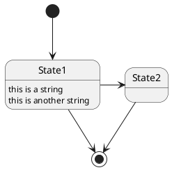


## Change state rendering

You can use ``hide empty description`` to render state as simple box.

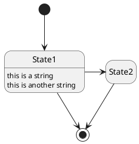


## Composite state


A state can also be composite. You have to define it using the ``state``
keywords and brackets.

###  Internal sub-state

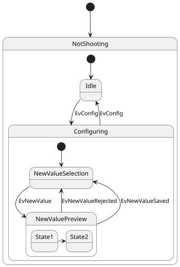


### Sub-state to sub-state

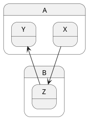

*[Ref. [QA-3300](https://forum.plantuml.net/3300/add-a-new-state-diagram-example)]*


## Long name


You can also use the ``state`` keyword to use long description
for states.

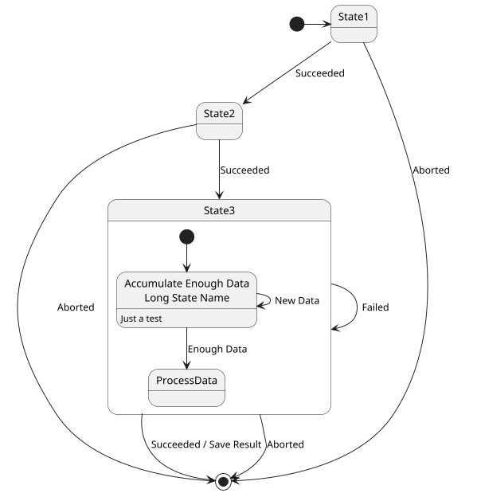


## History [[H], [H*]]

You can use ``[H]`` for the history and ``[H*]`` for the deep history of a substate. 

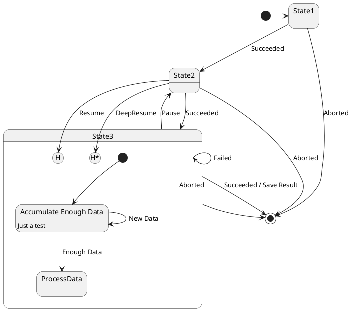


## Fork [fork, join]


You can also fork and join using the ``<<fork>>`` and ``<<join>>`` stereotypes.


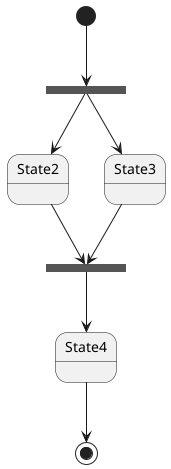


## Concurrent state [--, ||]


You can define concurrent state into a composite state using either ``--``
or ``||`` symbol as separator.

### Horizontal separator ``--``
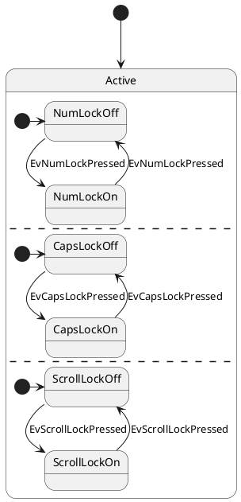

### Vertical separator ``||``
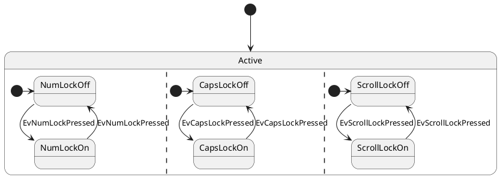

*[Ref. [QA-3086](https://forum.plantuml.net/3086/state-diagram-concurrent-state-horizontal-line)]*


## Conditional [choice]

The stereotype ``<<choice>>`` can be used to use conditional state.

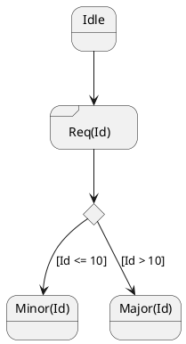


## Stereotypes full example [start, choice, fork, join, end, history, history*]

### Start, choice, fork, join, end
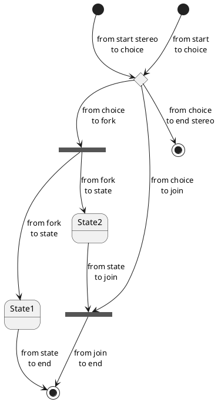


*[Ref. [QA-404](https://forum.plantuml.net/404/choice-pseudostate?show=436#c436), [QA-1159](https://forum.plantuml.net/1159/choice-pseudostate-and-guard-condition-in-state-diagrams?show=1161#a1161) and [GH-887](https://github.com/plantuml/plantuml/pull/887)]*

### History, history*
```plantuml
state A {
   state s1 as "Start 1" <<start>>
   state s2 as "H 2" <<history>>
   state s3 as "H 3" <<history*>>
}
```

*[Ref. [QA-16824](https://forum.plantuml.net/16824/can-history-deep-history-substates-specified-alias-manner)]*

### Minimal example with all stereotypes
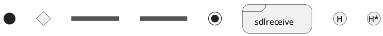

*[Ref. [QA-19174](https://forum.plantuml.net/19174/is-there-a-list-of-things-like-sdlreceive)]*


## Point [entryPoint, exitPoint]

You can add **point** with `<<entryPoint>>` and `<<exitPoint>>` stereotypes:

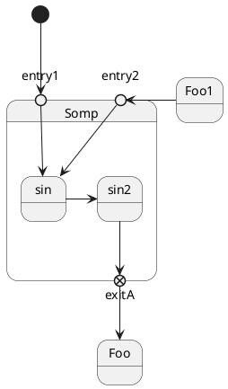


## Pin [inputPin, outputPin]

You can add **pin** with `<<inputPin>>` and `<<outputPin>>` stereotypes:

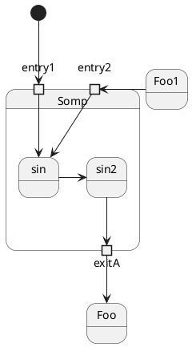

*[Ref. [QA-4309](https://forum.plantuml.net/4309/entrypoints-exitpoints-expansioninput-expansionoutput)]*


## Expansion [expansionInput, expansionOutput]

You can add **expansion** with `<<expansionInput>>` and `<<expansionOutput>>` stereotypes:

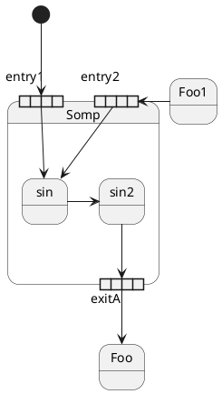

*[Ref. [QA-4309](https://forum.plantuml.net/4309/entrypoints-exitpoints-expansioninput-expansionoutput)]*


## Arrow direction

You can use ``->`` for horizontal arrows. It is possible to
force arrow's direction using the following syntax:
* ``-down->`` or ``-->``
* ``-right->`` or ``->`` *(default arrow)*
* ``-left->``
* ``-up->``

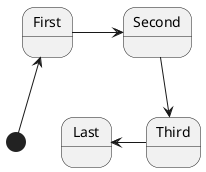
You can shorten the arrow definition by using only the first character of the direction (for example, ``-d-`` instead of
``-down-``)
or the two first characters (``-do-``).

Please note that you should not abuse this functionality : *Graphviz* gives usually good results without tweaking.


## Change line color and style

You can change line [color](color) and/or line style.

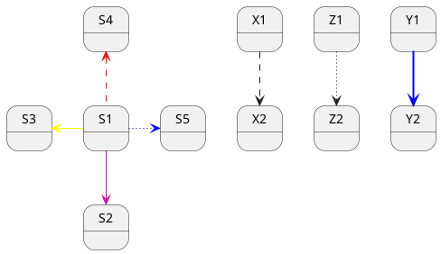

*[Ref. [QA-93](https://forum.plantuml.net/93/how-use-different-color-for-arrows-in-state-diagram)]*


## Change head or tail of arrow line

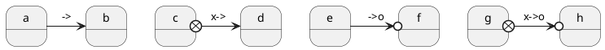


## Note

You can also define notes using
``note left of``, ``note right of``, ``note top of``, ``note bottom of``
keywords.

You can also define notes on several lines.
```plantuml
@startuml

[*] --> Active
Active --> Inactive

note left of Active : this is a short\nnote

note right of Inactive
  A note can also
  be defined on
  several lines
end note

@enduml
```

You can also add note on start or end state:
```plantuml
@startuml
state start <<start>>
start -> A
note left of start : this is a short note on start

state end <<end>>
A -> end

note right of end
 note
 on end
end note
@enduml
```
*[Ref. [QA-20400](https://forum.plantuml.net/20400/adding-a-note-to-start-and-end-state)]*

You can also have floating notes.
```plantuml
@startuml

state foo
note "This is a floating note" as N1

@enduml
```


## Note on link

You can put notes on state-transition or link, with ``note on link`` keyword.

```plantuml
@startuml
[*] -> State1
State1 --> State2
note on link 
  this is a state-transition note 
end note
@enduml
```


## More in notes


You can put notes on composite states.
```plantuml
@startuml

[*] --> NotShooting

state "Not Shooting State" as NotShooting {
  state "Idle mode" as Idle
  state "Configuring mode" as Configuring
  [*] --> Idle
  Idle --> Configuring : EvConfig
  Configuring --> Idle : EvConfig
}

note right of NotShooting : This is a note on a composite state

@enduml
```


## Inline color

```plantuml
@startuml
state CurrentSite #pink {
    state HardwareSetup #lightblue {
       state Site #brown
        Site -[hidden]-> Controller
        Controller -[hidden]-> Devices
    }
    state PresentationSetup{
        Groups -[hidden]-> PlansAndGraphics
    }
    state Trends #FFFF77
    state Schedule #magenta
    state AlarmSupression
}
@enduml
```

*[Ref. [QA-1812](https://forum.plantuml.net/1812)]*


## Skinparam


You can use the [skinparam](skinparam) command to change colors and fonts for the drawing.

You can use this command :
* In the diagram definition, like any other commands,
* In an [included file](preprocessing),
* In a configuration file, provided in the [command line](command-line) or the [Ant task](ant-task).
You can define specific color and fonts for stereotyped states.

```plantuml
@startuml
skinparam backgroundColor LightYellow
skinparam state {
  StartColor MediumBlue
  EndColor Red
  BackgroundColor Peru
  BackgroundColor<<Warning>> Olive
  BorderColor Gray
  FontName Impact
}

[*] --> NotShooting

state "Not Shooting State" as NotShooting {
  state "Idle mode" as Idle <<Warning>>
  state "Configuring mode" as Configuring
  [*] --> Idle
  Idle --> Configuring : EvConfig
  Configuring --> Idle : EvConfig
}

NotShooting --> [*]
@enduml
```

### Test of all specific skinparam to State Diagrams
```plantuml
@startuml
skinparam State {
  AttributeFontColor blue
  AttributeFontName serif
  AttributeFontSize  9
  AttributeFontStyle italic
  BackgroundColor palegreen
  BorderColor violet
  EndColor gold
  FontColor red
  FontName Sanserif
  FontSize 15
  FontStyle bold
  StartColor silver
}

state A : a a a\na
state B : b b b\nb

[*] -> A  : start
A -> B : a2b
B -> [*] : end
@enduml
```


## Changing style

You can change [style](style-evolution).

```plantuml
@startuml

<style>
stateDiagram {
  BackgroundColor Peru
  'LineColor Gray
  FontName Impact
  FontColor Red
  arrow {
    FontSize 13
    LineColor Blue
  }
}
</style>


[*] --> NotShooting

state "Not Shooting State" as NotShooting {
  state "Idle mode" as Idle <<Warning>>
  state "Configuring mode" as Configuring
  [*] --> Idle
  Idle --> Configuring : EvConfig
  Configuring --> Idle : EvConfig
}

NotShooting --> [*]
@enduml
```

```plantuml
@startuml
<style>
  diamond {
    BackgroundColor #palegreen
    LineColor #green
    LineThickness 2.5
}
</style>
state state1
state state2 
state choice1 <<choice>>
state end3    <<end>>

state1  --> choice1 : 1
choice1 --> state2  : 2
choice1 --> end3    : 3
@enduml
```
*[Ref. [GH-880](https://github.com/plantuml/plantuml/issues/880#issuecomment-1022278138)]*


## Change state color and style (inline style)

You can change the [color](color) or style of individual state using the following notation: 

* `#color ##[style]color` 

With background color first (`#color`), then line style and line color (`##[style]color` ).

```plantuml
@startuml
state FooGradient #red-green ##00FFFF
state FooDashed #red|green ##[dashed]blue {
}
state FooDotted ##[dotted]blue {
}
state FooBold ##[bold] {
}
state Foo1 ##[dotted]green {
state inner1 ##[dotted]yellow
}

state out ##[dotted]gold

state Foo2 ##[bold]green {
state inner2 ##[dotted]yellow
}
inner1 -> inner2
out -> inner2
@enduml
```
*[Ref. [QA-1487](https://forum.plantuml.net/1487)]*


* `#color;line:color;line.[bold|dashed|dotted];text:color`

[[#FFD700#FIXME]] 🚩
`text:color` seems not to be taken into account 
[[#FFD700#FIXME]]

```plantuml
@startuml
@startuml
state FooGradient #red-green;line:00FFFF
state FooDashed #red|green;line.dashed;line:blue {
}
state FooDotted #line.dotted;line:blue {
}
state FooBold #line.bold {
}
state Foo1 #line.dotted;line:green {
state inner1 #line.dotted;line:yellow
}

state out #line.dotted;line:gold

state Foo2 #line.bold;line:green {
state inner2 #line.dotted;line:yellow
}
inner1 -> inner2
out -> inner2
@enduml
@enduml
```
```plantuml
@startuml
state s1 : s1 description
state s2 #pink;line:red;line.bold;text:red : s2 description
state s3 #palegreen;line:green;line.dashed;text:green : s3 description
state s4 #aliceblue;line:blue;line.dotted;text:blue   : s4 description
@enduml
```

*[Adapted from [QA-3770](https://forum.plantuml.net/3770)]*


## Alias

With State you can use `alias`, like:

```plantuml
@startuml
state alias1 
state "alias2"
state "long name" as alias3
state alias4 as "long name"

alias1 : ""state alias1""
alias2 : ""state "alias2"""
alias3 : ""state "long name" as alias3""
alias4 : ""state alias4 as "long name"""

alias1 -> alias2
alias2 -> alias3
alias3 -> alias4
@enduml
```

or:
```plantuml
@startuml
state alias1 : ""state alias1""
state "alias2" : ""state "alias2"""
state "long name" as alias3 : ""state "long name" as alias3""
state alias4 as "long name" : ""state alias4 as "long name"""

alias1 -> alias2
alias2 -> alias3
alias3 -> alias4
@enduml
```


*[Ref. [QA-1748](https://forum.plantuml.net/1748/one-line-declaration-in-state-diagram), [QA-14560](https://forum.plantuml.net/14560/how-to-properly-use-as-with-state-declaration)]*


## Display JSON Data on State diagram

### Simple example
```plantuml
state "A" as stateA
state "C" as stateC {
 state B
}

json jsonJ {
   "fruit":"Apple",
   "size":"Large",
   "color": ["Red", "Green"]
}
```

*[Ref. [QA-17275](https://forum.plantuml.net/17275/composite-state-functionality-with-allow_mixing?show=17287#a17287)]*

For another example, see on [JSON page](json#wqimfur1rox7ld5sjljq).


## State description 

You can add description to a state or to a composite state.

```plantuml
@startuml
hide empty description 

state s0

state "This is the State 1" as s1 {
  s1: State description
  state s2
  state s3: long descr.
  state s4
  s4: long descr.
}

[*] -> s0
s0 --> s2

s2 -> s3
s3 -> s4
@enduml
```


*[Ref. [QA-16719](https://forum.plantuml.net/16719/how-state-description-when-using-composite-state-notation)]*


## Style for Nested State Body

```plantuml
@startuml
<style>
.foo {
  state,stateBody {
    BackGroundColor lightblue;
  }
}
</style>

state MainState <<foo>> {
  state SubA
}
@enduml
```


*[Ref. [QA-16774](https://forum.plantuml.net/16774/state-and-sub-states-background)]*

