## Timing Diagram

A [Timing Diagram](https://en.wikipedia.org/wiki/Timing_diagram_%28Unified_Modeling_Language%29) in UML is a specific type of **interaction diagram** that visualizes the **timing constraints** of a system. It focuses on the **chronological order of events**, showcasing how different objects interact with each other over time. **Timing diagrams** are especially useful in **real-time systems** and **embedded systems** to understand the behavior of objects throughout a given period.

*[Ref. of initial request [QA-5383](https://forum.plantuml.net/5383/please-implement-timing-diagrams)]*


## Declaring element or participant

You declare participant using the following keywords, depending on how you want them to be drawn.

| Keyword | Description |
| ------- | ----------- |
| ``analog``  | An ``analog`` signal is continuous, and the values are linearly interpolated between the given setpoints |
| ``binary``  | A `binary` signal restricted to only 2 states |
| ``clock``   | A `clocked` signal that repeatedly transitions from high to low, with a `period`, and an optional `pulse` and `offset` |
| ``concise`` | A simplified ``concise`` signal designed to show the movement of data (great for messages) |
| ``rectangle`` | A ``rectangle`` signal similar to ``concise`` but within a rectangle shape |
| ``robust``  | A ``robust`` complex line signal designed to show the transition from one state to another (can have many states) |


You define state change using the ``@`` notation, and the ``is`` verb.

```plantuml
@startuml
robust "Web Browser" as WB
concise "Web User" as WU
rectangle "Rect. Web User" as RWU

@0
WU is Idle
RWU is Idle
WB is Idle

@100
WU is Waiting
RWU is Waiting
WB is Processing

@300
WB is Waiting
@enduml
```

```plantuml
@startuml
clock   "Clock_0"   as C0 with period 50
clock   "Clock_1"   as C1 with period 50 pulse 15 offset 10
binary  "Binary"  as B
concise "Concise" as C
rectangle "Rectangle" as Re
robust  "Robust"  as R
analog  "Analog"  as A


@0
C is Idle
R is Idle
Re is Idle
A is 0

@100
B is high
C is Waiting
Re is Waiting
R is Processing
A is 3

@300
R is Waiting
A is 1
@enduml
```

*[Ref. [QA-14631](https://forum.plantuml.net/14631), [QA-14647](https://forum.plantuml.net/14647), [QA-11288](https://forum.plantuml.net/11288/mixed-signal-timing-diagram) and [GH-2409](https://github.com/plantuml/plantuml/issues/2409)]*


## Binary and Clock

It's also possible to have binary and clock signal, using the following keywords:

* ``binary``
* ``clock``

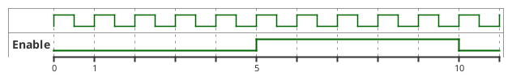


## Adding message

You can add message using the following syntax.

```plantuml
@startuml
robust "Web Browser" as WB
concise "Web User" as WU
rectangle "Rect. Web User" as RWU

@0
WU is Idle
RWU is Idle
WB is Idle


@100
WU -> WB : URL
WU is Waiting
RWU is Waiting
WB is Processing

@300
WB is Waiting
@enduml
```


## Relative time

It is possible to use relative time with ``@``.
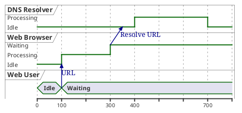


## Anchor Points

Instead of using absolute or relative time on an absolute time you can define a time as an anchor point by using the ``as`` keyword and starting the name with a ``:``. 

```
@XX as :<anchor point name>
```


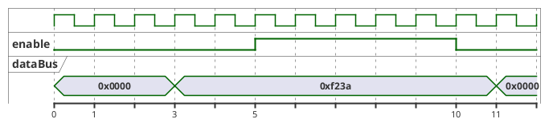


## Anchor Points with decimal offset

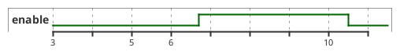

*[Ref. [QA-17885](https://forum.plantuml.net/17885/decimal-time-values-not-accepted-in-parameters-procedures)]*


## Participant oriented

Rather than declare the diagram in chronological order, you can define it by participant.

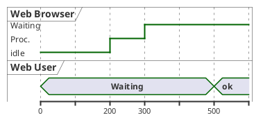


## Setting scale
You can also set a specific scale.
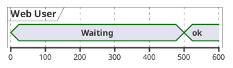

When using absolute Times/Dates, 1 "tick" is equivalent to 1 second.
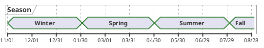


## Initial state
You can also define an inital state.
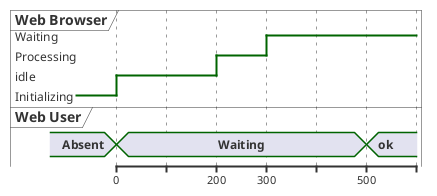


## Intricated state

A signal could be in some undefined state.

### Intricated or undefined robust state
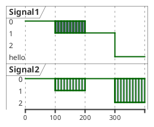

### Intricated or undefined binary state
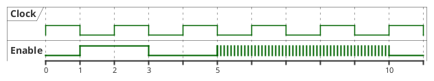

*[Ref. [QA-11936](https://forum.plantuml.net/11936) and [QA-15933](https://forum.plantuml.net/15933)]*


## Hidden state

It is also possible to hide some state.

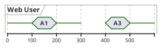

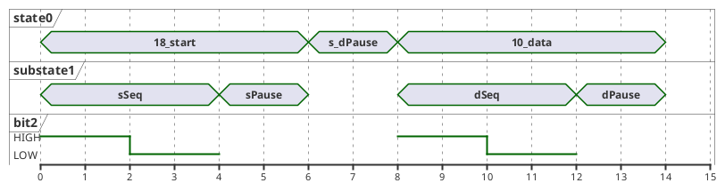
*[Ref. [QA-12222](https://forum.plantuml.net/12222)]*


## Negative time value

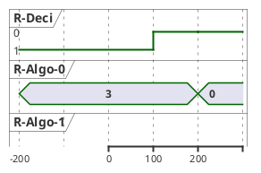

*[Ref. [QA-7698](https://forum.plantuml.net/7698/timing-diagram-allow-negative-time-values)]*


## Hide time axis

It is possible to hide time axis.

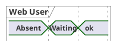


## Using Time and Date

It is possible to use time or date.


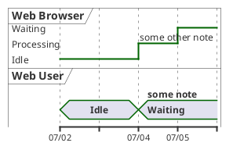


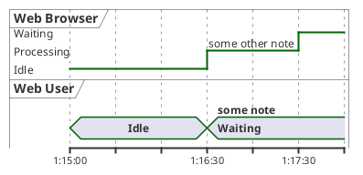

*[Ref. [QA-7019](https://forum.plantuml.net/7019/hh-mm-ss-time-format-in-timing-diagram)]*


## Change Date Format

It is also possible to change date format.

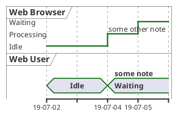


## Manage time axis labels

You can manage the time-axis labels.

### Label on each tick _(by default)_
```plantuml
@startuml
scale 31536000 as 40 pixels
use date format "yy-MM"

concise "OpenGL Desktop" as OD

@1992/01/01
OD is {hidden}

@1992/06/30
OD is 1.0

@1997/03/04
OD is 1.1

@1998/03/16
OD is 1.2

@2001/08/14
OD is 1.3

@2004/09/07
OD is 3.0

@2008/08/01
OD is 3.0

@2017/07/31
OD is 4.6

@enduml
```


### Manual label _(only when the state changes)_
```plantuml
@startuml
scale 31536000 as 40 pixels

manual time-axis
use date format "yy-MM"

concise "OpenGL Desktop" as OD

@1992/01/01
OD is {hidden}

@1992/06/30
OD is 1.0

@1997/03/04
OD is 1.1

@1998/03/16
OD is 1.2

@2001/08/14
OD is 1.3

@2004/09/07
OD is 3.0

@2008/08/01
OD is 3.0

@2017/07/31
OD is 4.6

@enduml
```

*[Ref. [GH-1020](https://github.com/plantuml/plantuml/issues/1020)]*


## Adding constraint
It is possible to display time constraints on the diagrams.
```plantuml
@startuml
robust "Web Browser" as WB
concise "Web User" as WU

WB is Initializing
WU is Absent

@WB
0 is idle
+200 is Processing
+100 is Waiting
WB@0 <-> @50 : {50 ms lag}

@WU
0 is Waiting
+500 is ok
@200 <-> @+150 : {150 ms}
@enduml
```


## Highlighted period

You can higlight a part of diagram.

```plantuml
@startuml
robust "Web Browser" as WB
concise "Web User" as WU

@0
WU is Idle
WB is Idle

@100
WU -> WB : URL
WU is Waiting #LightCyan;line:Aqua

@200
WB is Proc.

@300
WU -> WB@350 : URL2
WB is Waiting

@+200
WU is ok

@+200
WB is Idle

highlight 200 to 450 #Gold;line:DimGrey : This is my caption
highlight 600 to 700 : This is another\nhighlight
@enduml
```


*[Ref. [QA-10868](https://forum.plantuml.net/10868/highlighted-periods-in-timing-diagrams)]*


## Using notes

You can use the ``note top of`` and ``note bottom of``
keywords to define notes related to a single object or participant *(available only for *`concise`* or *`binary`* object).*

```plantuml
@startuml
robust "Web Browser" as WB
concise "Web User" as WU

@0
WU is Idle
WB is Idle

@100
WU is Waiting
WB is Processing
note top of WU : first note\non several\nlines
note bottom of WU : second note\non several\nlines

@300
WB is Waiting
@enduml
```

*[Ref. [QA-6877](https://forum.plantuml.net/6877), [GH-1465](https://github.com/plantuml/plantuml/issues/1465)]*


## Adding texts

You can optionally add a title, a header, a footer, a legend and a caption:

```plantuml
@startuml
Title This is my title
header: some header
footer: some footer
legend
Some legend
end legend
caption some caption

robust "Web Browser" as WB
concise "Web User" as WU

@0
WU is Idle
WB is Idle

@100
WU is Waiting
WB is Processing

@300
WB is Waiting
@enduml
```


## Complete example


Thanks to [Adam Rosien](https://twitter.com/arosien) for this example.

```plantuml
@startuml
concise "Client" as Client
concise "Server" as Server
concise "Response freshness" as Cache

Server is idle
Client is idle

@Client
0 is send
Client -> Server@+25 : GET
+25 is await
+75 is recv
+25 is idle
+25 is send
Client -> Server@+25 : GET\nIf-Modified-Since: 150
+25 is await
+50 is recv
+25 is idle
@100 <-> @275 : no need to re-request from server

@Server
25 is recv
+25 is work
+25 is send
Server -> Client@+25 : 200 OK\nExpires: 275
+25 is idle
+75 is recv
+25 is send
Server -> Client@+25 : 304 Not Modified
+25 is idle

@Cache
75 is fresh
+200 is stale
@enduml
```


## Digital Example

```plantuml
@startuml
scale 5 as 150 pixels

clock clk with period 1
binary "enable" as en
binary "R/W" as rw
binary "data Valid" as dv
concise "dataBus" as db
concise "address bus" as addr

@6 as :write_beg
@10 as :write_end

@15 as :read_beg
@19 as :read_end


@0
en is low
db is "0x0"
addr is "0x03f"
rw is low
dv is 0

@:write_beg-3
 en is high
@:write_beg-2
 db is "0xDEADBEEF"
@:write_beg-1
dv is 1
@:write_beg
rw is high


@:write_end
rw is low
dv is low
@:write_end+1
rw is low
db is "0x0"
addr is "0x23"

@12
dv is high
@13 
db is "0xFFFF"

@20
en is low
dv is low
@21 
db is "0x0"

highlight :write_beg to :write_end #Gold:Write
highlight :read_beg to :read_end #lightBlue:Read

db@:write_beg-1 <-> @:write_end : setup time
db@:write_beg-1 -> addr@:write_end+1 : hold
@enduml
```


## Adding color

You can add [color](color).

```plantuml
@startuml
concise "LR" as LR
concise "ST" as ST

LR is AtPlace #palegreen
ST is AtLoad #gray

@LR
0 is Lowering
100 is Lowered #pink
350 is Releasing
 
@ST
200 is Moving
@enduml
```

*[Ref. [QA-5776](https://forum.plantuml.net/5776)]*


## Using (global) style

### Without style *(by default)*
```plantuml
@startuml
robust "Web Browser" as WB
concise "Web User" as WU

WB is Initializing
WU is Absent

@WB
0 is idle
+200 is Processing
+100 is Waiting
WB@0 <-> @50 : {50 ms lag}

@WU
0 is Waiting
+500 is ok
@200 <-> @+150 : {150 ms}
@enduml
```


### With style

You can use [style](style-evolution) to change rendering of elements.

```plantuml
@startuml
<style>
timingDiagram {
  document {
    BackGroundColor SandyBrown
  }
 constraintArrow {
  LineStyle 2-1
  LineThickness 3
  LineColor Blue
 }
}
</style>
robust "Web Browser" as WB
concise "Web User" as WU

WB is Initializing
WU is Absent

@WB
0 is idle
+200 is Processing
+100 is Waiting
WB@0 <-> @50 : {50 ms lag}

@WU
0 is Waiting
+500 is ok
@200 <-> @+150 : {150 ms}
@enduml
```

*[Ref.  [QA-14340](https://forum.plantuml.net/14340/color-of-arrow-in-timing-diagram)]*


## Applying Colors to specific lines

You can use the `<style>` tags and sterotyping to give a name to line attributes.

```plantuml
@startuml
<style>
timingDiagram {
  .red {
    LineColor red
  }
  .blue {
    LineColor blue
    LineThickness 5
  }
}
</style>

clock clk with period 1
binary "Input Signal 1"  as IS1
binary "Input Signal 2"  as IS2 <<blue>>
binary "Output Signal 1" as OS1 <<red>>

@0
IS1 is low
IS2 is high
OS1 is low
@2
OS1 is high
@4
OS1 is low
@5
IS1 is high
OS1 is high
@6
IS2 is low
@10
IS1 is low
OS1 is low
@enduml
```

*[[Ref. QA-15870](https://forum.plantuml.net/15870/timing-diagram-assign-different-colors-single-participants?show=15870#q15870)]*


## Compact mode

You can use `compact` command to compact the timing layout.

### By default
```plantuml
@startuml
robust "Web Browser" as WB
concise "Web User" as WU
robust "Web Browser2" as WB2

@0
WU is Waiting
WB is Idle
WB2 is Idle

@200
WB is Proc.

@300
WB is Waiting
WB2 is Waiting

@500
WU is ok

@700
WB is Idle
@enduml
```

#### Global mode with `mode compact`
```plantuml
@startuml
mode compact
robust "Web Browser" as WB
concise "Web User" as WU
robust "Web Browser2" as WB2

@0
WU is Waiting
WB is Idle
WB2 is Idle

@200
WB is Proc.

@300
WB is Waiting
WB2 is Waiting

@500
WU is ok

@700
WB is Idle
@enduml
```

### Local mode with only `compact` on element
```plantuml
@startuml
compact robust "Web Browser" as WB
compact concise "Web User" as WU
robust "Web Browser2" as WB2

@0
WU is Waiting
WB is Idle
WB2 is Idle

@200
WB is Proc.

@300
WB is Waiting
WB2 is Waiting

@500
WU is ok

@700
WB is Idle
@enduml
```

*[Ref. [QA-11130](https://forum.plantuml.net/11130/is-there-a-compact-timing-diagram)]*


## Scaling analog signal

You can scale analog signal.

### Without scaling: 0-max _(by default)_
```plantuml
@startuml
title Between 0-max (by default)
analog "Analog" as A

@0
A is 350

@100
A is 450

@300
A is 350
@enduml
```


### With scaling: min-max
```plantuml
@startuml
title Between min-max
analog "Analog" between 350 and 450 as A

@0
A is 350

@100
A is 450

@300
A is 350
@enduml
```

*[Ref. [QA-17161](https://forum.plantuml.net/17161/timing-diagram-better-scaling-of-analog-values)]*


## Customise analog signal

### Without any customisation _(by default)_
```plantuml
@startuml
analog "Vcore" as VDD
analog "VCC" as VCC

@0
VDD is 0
VCC is 3
@2
VDD is 0
@3
VDD is 6
VCC is 6
VDD@1 -> VCC@2 : "test"
@enduml
```

### With customisation (on scale, ticks and height)
```plantuml
@startuml
analog "Vcore" as VDD
analog "VCC" between -4.5 and 6.5 as VCC
VCC ticks num on multiple 3
VCC is 200 pixels height

@0
VDD is 0
VCC is 3
@2
VDD is 0
@3
VDD is 6
VCC is 6
VDD@1 -> VCC@2 : "test"
@enduml
```

*[Ref. [QA-11288](https://forum.plantuml.net/11288/mixed-signal-timing-diagram?show=11397#c11397)]*


## Order state of robust signal

### Without order _(by default)_
```plantuml
@startuml
robust "Flow rate" as rate

@0
rate is high

@5
rate is none

@6
rate is low
@enduml
```

### With order
```plantuml
@startuml
robust "Flow rate" as rate
rate has high,low,none

@0
rate is high

@5
rate is none

@6
rate is low
@enduml
```

### With order and label
```plantuml
@startuml
robust "Flow rate" as rate
rate has "35 gpm" as high
rate has "15 gpm" as low
rate has "0 gpm" as none

@0
rate is high

@5
rate is none

@6
rate is low
@enduml
```

*[Ref. [QA-6651](https://forum.plantuml.net/6651/order-of-states-in-timing-diagram)]*


## Defining a timing diagram

### By Clock _(@clk)_
```plantuml
@startuml
clock "clk" as clk with period 50
concise "Signal1" as S1
robust "Signal2" as S2
binary "Signal3" as S3
 
@clk*0
S1 is 0
S2 is 0

@clk*1
S1 is 1
S3 is high

@clk*2
S3 is down

@clk*3
S1 is 1
S2 is 1
S3 is 1

@clk*4
S3 is down
@enduml
```

### By Signal _(@S)_
```plantuml
@startuml
clock "clk" as clk with period 50
concise "Signal1" as S1
robust "Signal2" as S2
binary "Signal3" as S3

@S1
0 is 0
50 is 1
150 is 1

@S2
0 is 0
150 is 1

@S3
50  is 1
100 is low
150 is high
200 is 0
@enduml
```

### By Time _(@time)_
```plantuml
@startuml
clock "clk" as clk with period 50
concise "Signal1" as S1
robust "Signal2" as S2
binary "Signal3" as S3

@0
S1 is 0
S2 is 0

@50
S1 is 1
S3 is 1

@100
S3 is low

@150
S1 is 1
S2 is 1
S3 is high

@200
S3 is 0
@enduml
```

*[Ref. [QA-9053](https://forum.plantuml.net/9053/timing-diagrams-for-binary-signal-and-data-buses?show=9057#a9057)]*


## Annotate signal with comment

```plantuml
@startuml
binary "Binary Serial Data" as D
robust "Robust" as R
concise "Concise" as C

@-3
D is low: idle
R is lo: idle
C is 1: idle
@-1
D is high: start
R is hi: start
C is 0: start

@0
D is low: 1 lsb
R is lo: 1 lsb
C is 1: lsb

@1
D is high: 0
R is hi: 0
C is 0

@6
D is low: 1
R is lo: 1
C is 1

@7
D is high: 0 msb
R is hi: 0 msb
C is 0: msb

@8
D is low: stop
R is lo: stop
C is 1: stop

@0 <-> @8 : Serial data bits for ASCII "A" (Little Endian)
@enduml
```

*[Ref. [QA-15762](https://forum.plantuml.net/15762/annotate-binary-waveforms), and [QH-888](https://github.com/plantuml/plantuml/issues/888)]*

